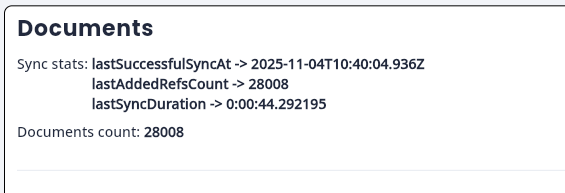
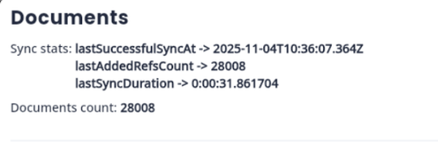
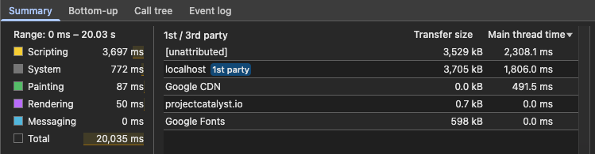
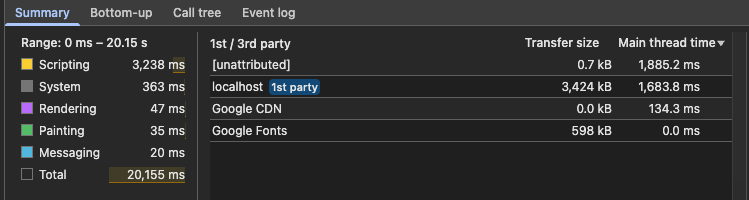

# WASM performance improvements

This document describes the performance gains after migrating from JS to WASM flutter web builds.

## Migration

When building a flutter web app, add the `--wasm` flag:

```sh
flutter build web --wasm
```

## Documents indexing

Early tests with large quantities of documents (28k) show document sync time reduction up to ~30%.

Benchmark script (include `--wasm` flag only when testing wasm):

```sh
flutter run --target=lib/configs/main_web.dart \
--device-id=chrome \
--profile \
--wasm \
--dart-define=ENV_NAME=dev \
--dart-define=STRESS_TEST=true \
--dart-define=STRESS_TEST_PROPOSAL_INDEX_COUNT=4000 \
--dart-define=STRESS_TEST_DECOMPRESSED=false \
--dart-define=STRESS_TEST_CLEAR_DB=true \
--web-port=5554 \
--web-header=Cross-Origin-Opener-Policy=same-origin \
--web-header=Cross-Origin-Embedder-Policy=require-corp
```

| Backend | Sync time | Screenshot |
| ------- | ------- | ---------- |
| JS | ~44.3s |  |
| WASM | ~31.9s |  |

> Screenshots obtained from the in-app dev tools console.

## Overall code execution

The benchmark measures overall code execution speed during the initial 20s when loading
the application for the first time.

Wasm migration reduces the CPU time by ~20% compared to the same code executed as JS.

Benchmark script (include `--wasm` flag only when testing wasm):

```sh
flutter run --target=lib/configs/main_web.dart \
--device-id=chrome \
--profile \
--wasm \
--dart-define=ENV_NAME=dev \
--dart-define=STRESS_TEST=true \
--dart-define=STRESS_TEST_PROPOSAL_INDEX_COUNT=4000 \
--dart-define=STRESS_TEST_DECOMPRESSED=false \
--dart-define=STRESS_TEST_CLEAR_DB=true \
--web-port=5554 \
--web-header=Cross-Origin-Opener-Policy=same-origin \
--web-header=Cross-Origin-Embedder-Policy=require-corp
```

| Backend | CPU time | Screenshot |
| ------- | ------- | ---------- |
| JS | 4606ms |  |
| WASM | 3703ms |  |

> Screenshots obtained from the browser performance console.

## Notes

* All tests were executed on a Mac Studio with M1 max and 64 GB of RAM.
* All tests were performed on the chrome browser.
