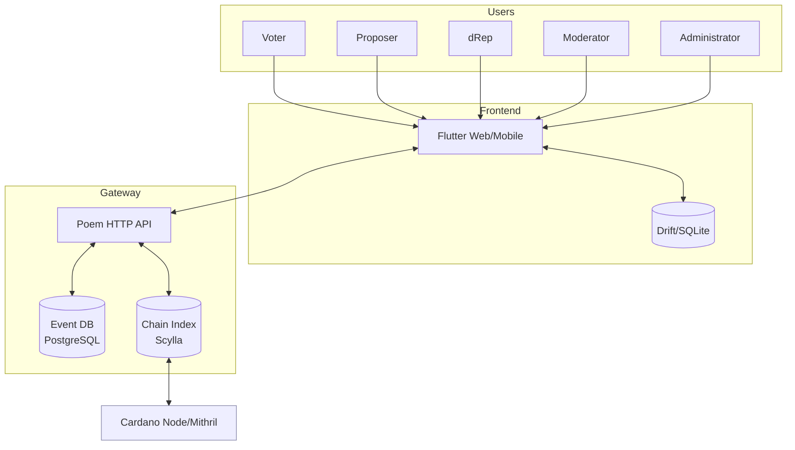

# System Scope and Context

<!-- See: https://docs.arc42.org/section-3/ -->

## Business Context

Catalyst Voices supports the full lifecycle from proposal creation to community voting for Catalyst events.

It connects users and roles to event rules while integrating Cardano chain data to establish permissions and voting power.

External actors and systems:

| External | Description |
| --- | --- |
| Voter | Community member who registers and votes in events |
| Proposer | Individual or team creating and maintaining proposals |
| dRep | Catalyst delegate registered via CIP-509 and using signed documents for nomination and delegation |
| Moderator | Role that moderates and curates content within event rules |
| Administrator | Operates events, categories, templates, and schedules |
| Auditor | Third party verifying processes and results |
| Cardano Network | Source of stake snapshots and on-chain registrations |
| Wallets and Tools | User tools to register under CIP-509 with legacy CIP-36 support |

High level context:

Explanation of external domain interfaces:

* Voting power and eligibility derive from stake snapshots and on-chain registrations.
* The system does not custody ADA or on-chain funds for voting or proposals.
* Users interact with the client to sign off-chain content and submit to the gateway.
* RBAC registrations and legacy CIP-36 registrations are on-chain transactions submitted via wallets or direct node submission.
* The gateway does not proxy transaction submissions over HTTP and ingests chain data via the Cardano N2N protocol.

## Technical Context

Primary interfaces and protocols:

| Interface | Producer | Consumer | Protocol | Format |
| --- | --- | --- | --- | --- |
| Document PUT | Client | Gateway | HTTPS | CBOR COSE_Sign body |
| Document GET | Client | Gateway | HTTPS | CBOR COSE_Sign body |
| Document Index | Client | Gateway | HTTPS | JSON request and JSON index |
| RBAC and CIP-36 (legacy) | Client | Cardano | N2N/N2C transaction submission | CBOR transaction |
| dRep nomination/delegation | Client | Gateway | HTTPS | CBOR COSE_Sign document |
| Health and Metrics | Infra | Gateway | HTTPS | JSON and Prometheus text |
| Chain ingest | Gateway | Cardano | Cardano N2N Protocol | Block and ledger data |

Authentication and authorization:

* Unauthenticated read for public documents by design.
* RBAC Bearer tokens enable write operations and protected reads.
* On-chain registrations and stake data drive server side authorization checks.

Input and output mapping:

* User actions produce signed documents that are validated and persisted through the gateway.
* Client caches mirror server state for responsiveness and offline continuity.
* Index queries return references that can be dereferenced to full documents on demand.
