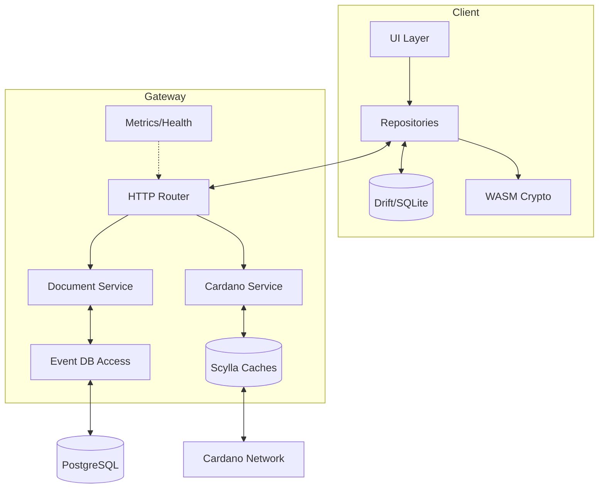
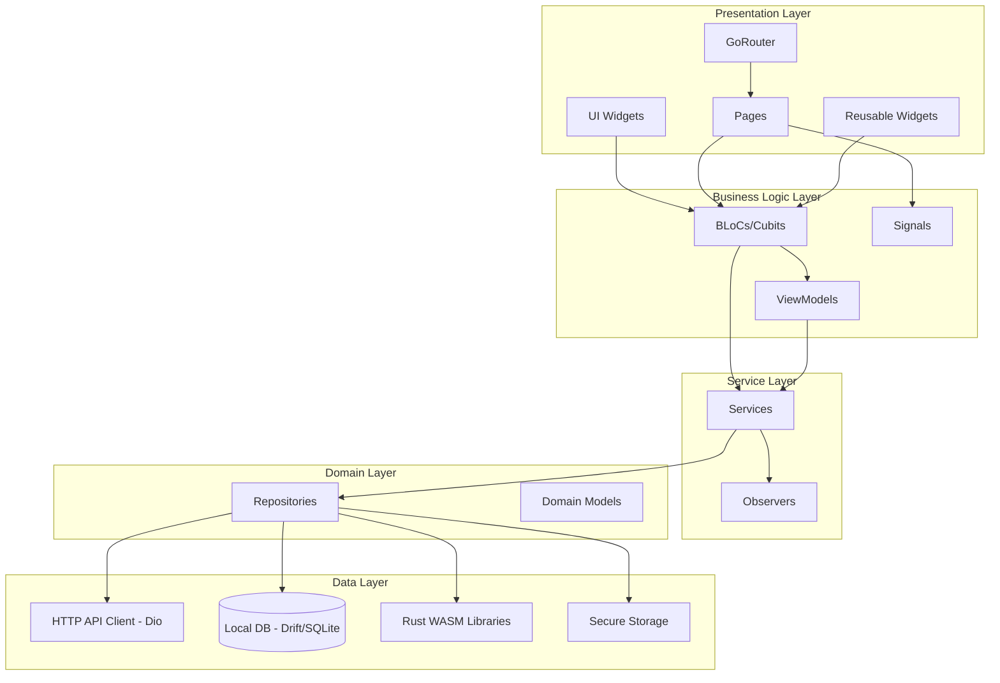

# Building Block View

<!-- See: https://docs.arc42.org/section-5/ -->

## White box Overall System

The system is split into a Flutter client and a Rust gateway with shared specifications and generated clients.

Motivation:

The separation enables fast client experiences with local data while centralizing validation and integration with Cardano.

Contained building blocks:

* UI Layer: Screens and user flows for proposal and voting features.
* Repositories: Data access orchestrating HTTP APIs, local cache, and transformations.
* Local Database: Drift based SQLite for offline and responsive UX.
* Crypto Libraries: WASM backed key derivation and compression used from Dart.
* HTTP Router: Poem powered API surface and OpenAPI documentation.
* Document Service: Validation and storage of signed documents and their versions.
* Cardano Service: Read-only endpoints for RBAC registrations (CIP-509 primary), legacy CIP-36 data, and staking information.
* Event DB Access: Persistence layer for event data in PostgreSQL.
* Scylla Caches: Chain follower and caches for chain derived information at scale.
* Metrics and Health: Liveness, readiness, and Prometheus metrics for operations.

Important interfaces:

* `PUT /v1/document` Accepts a COSE_Sign CBOR document for idempotent creation.
* `GET /v1/document/:id` Returns a COSE CBOR document at a version or latest.
* `POST /v2/document/index` Returns a paged index of documents matching a filter.
* `GET /cardano/rbac/...` Returns on-chain RBAC registration information.
* `GET /cardano/cip36/...` Returns legacy voter registration and stake related data.
* All registration submissions occur on-chain via Cardano transaction submission and not through the gateway.
* `GET /health/*` and `/metrics` expose operational status and metrics.

## Level 2

### White Box Document Service

Purpose and responsibilities:

* Validate COSE signatures and signer permissions.
* Enforce template compatibility and version references.
* Persist documents and maintain latest pointers and indexes.

Interfaces:

* `PUT /v1/document` and `GET /v1/document/:id` plus index query endpoint.

Quality characteristics:

* Idempotent writes and content based deduplication reduce accidental duplication.
* Validation errors return structured unprocessable content details.

### White Box Cardano Service

Purpose and responsibilities:

* Serve RBAC registration chains and stake information for clients and gateway checks.
* Normalize data from Scylla caches into API responses.

Interfaces:

* `GET /cardano/rbac/...` and `GET /cardano/cip36/...` (legacy) endpoints.

Quality characteristics:

* Read heavy endpoints optimized via Scylla and in memory caches.

### White Box Repositories (Client)

Purpose and responsibilities:

* Aggregate server responses and local state into UI friendly models.
* Handle pagination, retries, and background refresh.

Interfaces:

* HTTP client based on OpenAPI specification with request and response interceptors.

Quality characteristics:

* Predictable behavior and testability with generated types and fixtures.

### Frontend Application (cat-voices)

Purpose and responsibilities:

The Catalyst Voices frontend application is a Flutter-based application
that provides the user interface for proposal creation, voting,
and event management.
It follows Clean Architecture principles with BLoC pattern for state management.

Architecture Layers:

Contained building blocks:

* **Presentation Layer**:
    * **Pages**: Feature-specific page widgets (proposal, voting, discovery, workspace, etc.)
    * **Widgets**: Reusable UI components
    * **Router**: GoRouter-based navigation with type-safe routes
    * **Theming**: Material Design with custom theming system

* **Business Logic Layer**:
    * **BLoCs/Cubits**: State management using flutter_bloc
        * Session management (SessionCubit)
        * Workspace management (WorkspaceBloc)
        * Voting (VotingCubit)
        * Proposals (ProposalsCubit)
        * Account (AccountCubit)
        * Discovery (DiscoveryCubit)
    * **ViewModels**: Presentation logic abstraction
    * **Signals**: User event information mechanism (snackbars, route changes) handled in pages

* **Service Layer**:
    * **Services**: Business logic services that merge information from different sources
        * ProposalService: Merges local and remote proposals into unified streams
        * UserService: Manages user state and authentication
        * CampaignService: Handles campaign data and active campaign tracking
        * VotingService: Manages voting operations
        * DocumentsService: Handles document synchronization
    * **Observers**: Cross-BLoC communication mechanism via service layer
        * UserObserver: Tracks user state changes
        * ActiveCampaignObserver: Tracks active campaign changes
        * CastedVotesObserver: Tracks vote casting events

* **Domain Layer**:
    * **Repositories**: Data access abstraction
        * Document repository
        * Event repository
        * User repository
        * Proposal repository
        * Voting repository
    * **Models**: Domain entities and value objects

* **Data Layer**:
    * **HTTP API Client**: OpenAPI-based client using Dio (not code-generated)
    * **Local Database**: Drift-based SQLite with JSONB support
        * Uses BlobColumn with DocumentConverters for document content storage
        * Complex SQLite queries with JSONB functions (SQLite 3.45.0+)
        * Schema migrations with versioned drift schemas
    * **WASM Libraries**: Rust-based cryptographic operations
        * catalyst_key_derivation: Key derivation from mnemonics (Rust)
        * catalyst_compression: Brotli and Zstd compression (Rust)
        * Compiled to WASM for Web, native libraries for mobile
    * **Secure Storage**: Flutter Secure Storage for sensitive data
        * Encrypted keychain data storage
        * Secure encryption/decryption of local keychain data

Key architectural patterns:

* **Clean Architecture**: Clear separation of concerns across layers
* **BLoC Pattern**: Reactive state management with events and states
* **Service Layer Pattern**: Services merge data from multiple sources (local and remote)
* **Repository Pattern**: Abstraction of data sources
* **Observer Pattern**: Cross-BLoC communication via observers in service layer
* **Dependency Injection**: Manual DI via constructor injection
* **Offline-First**: Local database enables full offline functionality
* **Signal Pattern**: User event information (not direct BLoC-to-BLoC communication)

Interfaces:

* **Navigation**: Type-safe routing via GoRouter
* **State Management**: Stream-based reactive updates via BLoC
* **Data Access**: Repository interfaces abstracting API and local storage
* **Service Communication**: Observer pattern for cross-feature communication
* **Platform Integration**: Platform channels for native features

Quality characteristics:

* **Testability**: Clear separation enables unit and widget testing
* **Maintainability**: Consistent patterns across features
* **Scalability**: Modular architecture supports feature growth
* **Performance**: Local caching and reactive updates for responsiveness
* **Offline Support**: Full functionality without network connectivity

#### Frontend Internal Packages

The frontend application is organized into internal packages for separation of concerns:

* **catalyst_voices_blocs**: State management (BLoCs, Cubits, States, Events)
    * 20+ feature-specific BLoCs
    * Common mixins for error handling and signals
    * Cache management for performance

* **catalyst_voices_repositories**: Data access layer
    * Repository implementations
    * Database schema and migrations (Drift)
    * API client integration
    * Local storage management

* **catalyst_voices_models**: Domain models and value objects
    * Serialization/deserialization
    * Validation logic

* **catalyst_voices_view_models**: Presentation logic
    * ViewModel implementations
    * UI state transformations

* **catalyst_voices_services**: Business logic services
    * Service implementations
    * Cross-cutting concerns
    * Data merging from multiple sources

* **catalyst_voices_shared**: Shared utilities
    * Common extensions
    * Helper functions
    * Constants

* **catalyst_voices_assets**: Asset management
    * SVG compilation
    * Image assets

* **catalyst_voices_localization**: Internationalization
    * ARB files for translations
    * Generated localization code

* **catalyst_voices_brands**: Branding system
    * Theme configuration
    * Brand-specific styling

## Level 3

### White Box Chain Follower and Caches

Responsibilities:

* Track registered transactions and chains relevant to Catalyst roles.
* Maintain persistent and volatile caches for low latency lookups.

Interactions:

* Periodically synchronize with configured Cardano networks.
* Update metrics for freshness and cache hit ratios.
