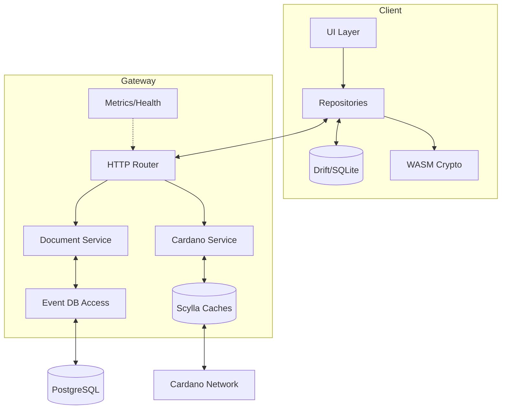

# Building Block View

<!-- See: https://docs.arc42.org/section-5/ -->

## White box Overall System

The system is split into a Flutter client and a Rust gateway with shared specifications and generated clients.

Motivation:

The separation enables fast client experiences with local data while centralizing validation and integration with Cardano.

Contained building blocks:

* UI Layer: Screens and user flows for proposal and voting features.
* Repositories: Data access orchestrating HTTP APIs, local cache, and transformations.
* Local Database: Drift based SQLite for offline and responsive UX.
* Crypto Libraries: WASM backed key derivation and compression used from Dart.
* HTTP Router: Poem powered API surface and OpenAPI documentation.
* Document Service: Validation and storage of signed documents and their versions.
* Cardano Service: Read-only endpoints for RBAC registrations (CIP-509 primary), legacy CIP-36 data, and staking information.
* Event DB Access: Persistence layer for event data in PostgreSQL.
* Scylla Caches: Chain follower and caches for chain derived information at scale.
* Metrics and Health: Liveness, readiness, and Prometheus metrics for operations.

Important interfaces:

* `PUT /v1/document` Accepts a COSE_Sign CBOR document for idempotent creation.
* `GET /v1/document/:id` Returns a COSE CBOR document at a version or latest.
* `POST /v2/document/index` Returns a paged index of documents matching a filter.
* `GET /cardano/rbac/...` Returns on-chain RBAC registration information.
* `GET /cardano/cip36/...` Returns legacy voter registration and stake related data.
* All registration submissions occur on-chain via Cardano transaction submission and not through the gateway.
* `GET /health/*` and `/metrics` expose operational status and metrics.

## Level 2

### White Box Document Service

Purpose and responsibilities:

* Validate COSE signatures and signer permissions.
* Enforce template compatibility and version references.
* Persist documents and maintain latest pointers and indexes.

Interfaces:

* `PUT /v1/document` and `GET /v1/document/:id` plus index query endpoint.

Quality characteristics:

* Idempotent writes and content based deduplication reduce accidental duplication.
* Validation errors return structured unprocessable content details.

### White Box Cardano Service

Purpose and responsibilities:

* Serve RBAC registration chains and stake information for clients and gateway checks.
* Normalize data from Scylla caches into API responses.

Interfaces:

* `GET /cardano/rbac/...` and `GET /cardano/cip36/...` (legacy) endpoints.

Quality characteristics:

* Read heavy endpoints optimized via Scylla and in memory caches.

### White Box Repositories (Client)

Purpose and responsibilities:

* Aggregate server responses and local state into UI friendly models.
* Handle pagination, retries, and background refresh.

Interfaces:

* HTTP client generated from OpenAPI with request and response interceptors.

Quality characteristics:

* Predictable behavior and testability with generated types and fixtures.

## Level 3

### White Box Chain Follower and Caches

Responsibilities:

* Track registered transactions and chains relevant to Catalyst roles.
* Maintain persistent and volatile caches for low latency lookups.

Interactions:

* Periodically synchronize with configured Cardano networks.
* Update metrics for freshness and cache hit ratios.
