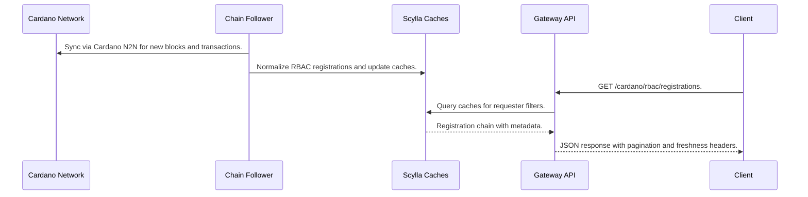
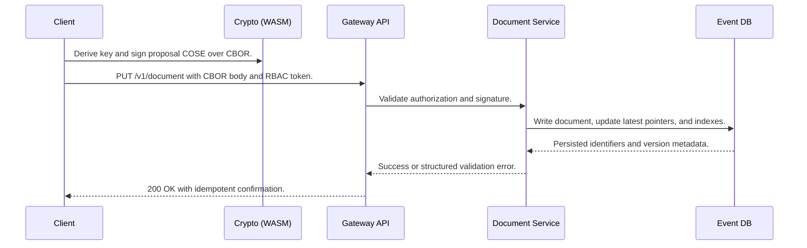
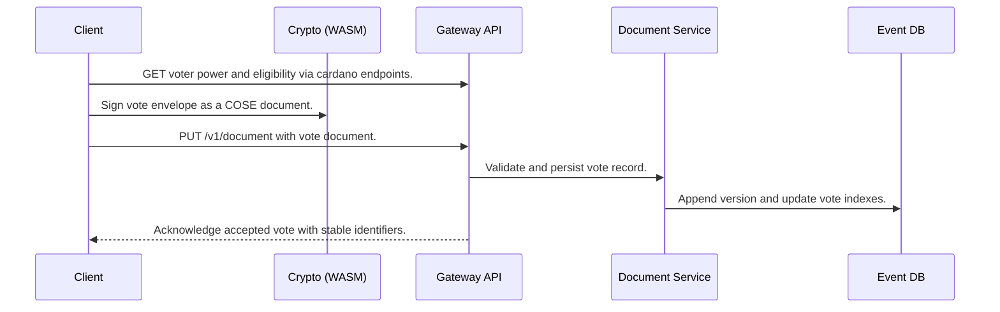

# Runtime View

<!-- See: https://docs.arc42.org/section-6/ -->

## RBAC Registration Surfacing

This scenario shows how an on-chain RBAC registration becomes available to clients.

Notable aspects:

* Reads are eventually consistent with chain data freshness reported via metrics and headers.
* Cache updates are idempotent and retried to avoid gaps when data is stale.

## Proposal Submission

This scenario shows how a user submits a new versioned proposal document.

Notable aspects:

* The operation is idempotent to avoid duplicate writes across retries.
* Validation errors include actionable fields to guide user correction.

## Voting and Confirmation

This scenario shows a user casting a vote and receiving confirmation.

Notable aspects:

* Vote documents are versioned and auditable through indexes without exposing secret material.
* Confirmation proceeds after server side checks on event timing and role permissions.
