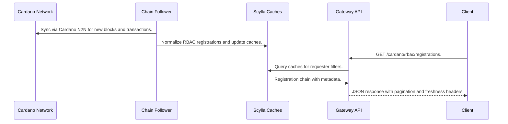
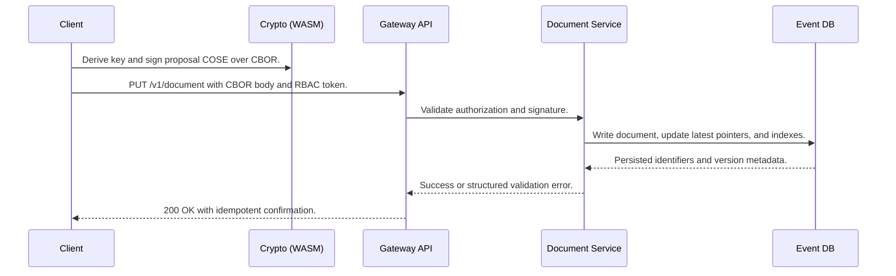
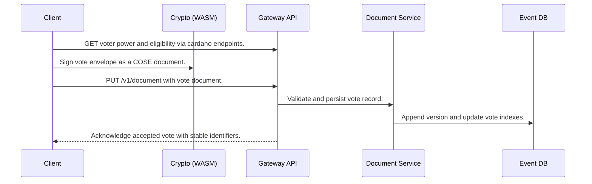
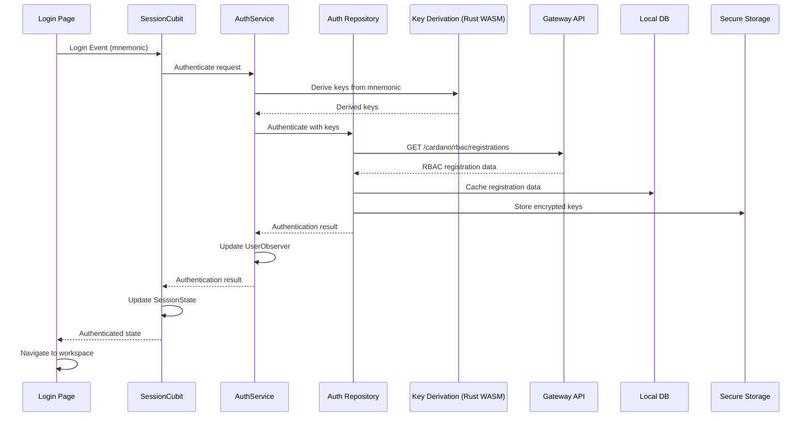
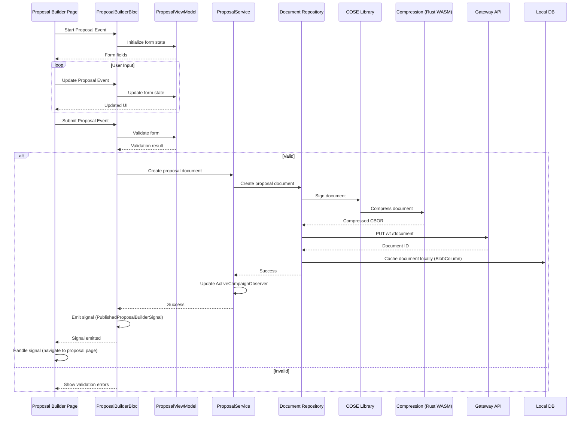
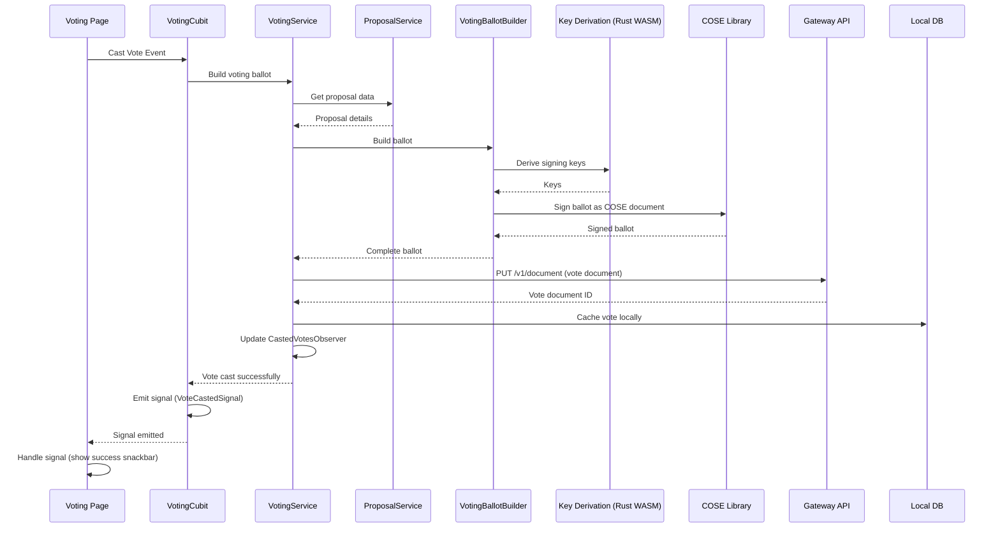
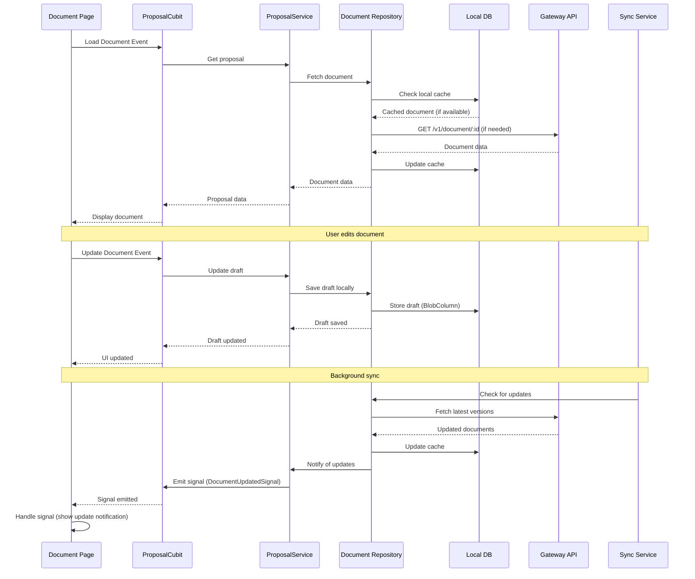
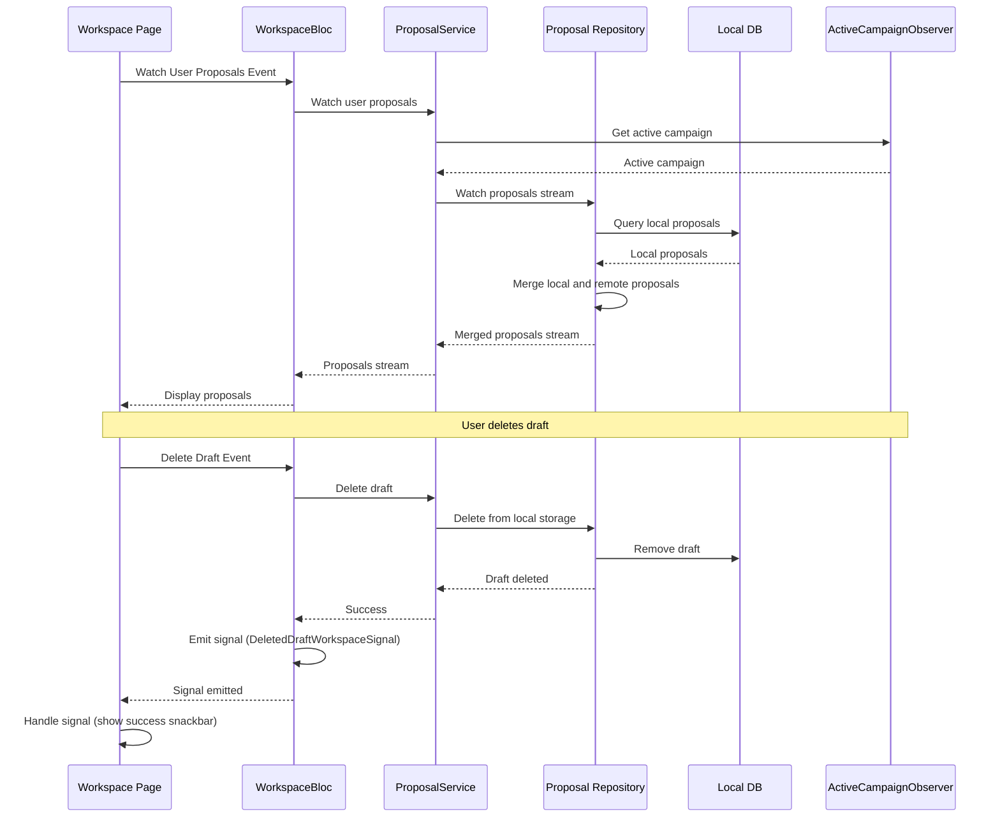
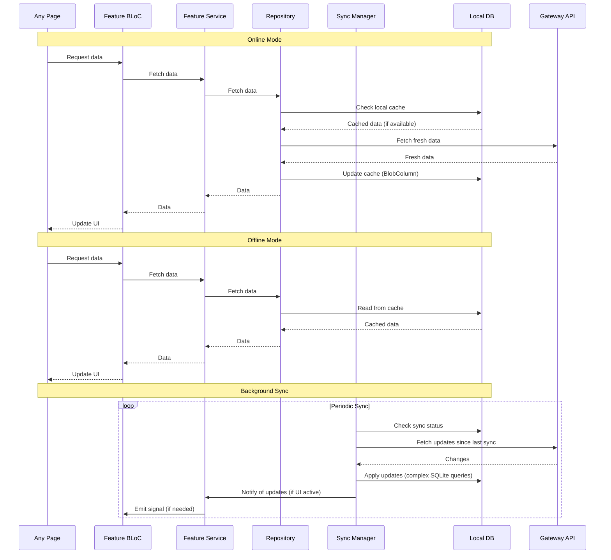
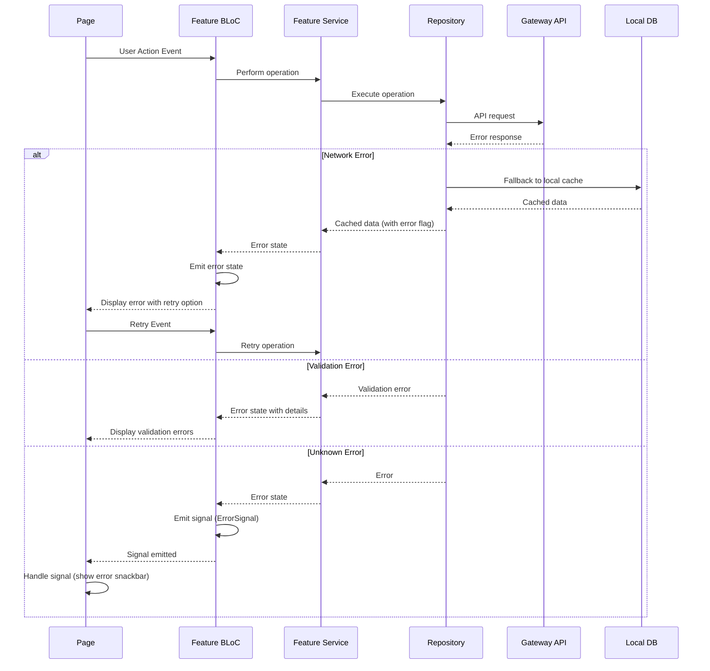

# Runtime View

<!-- See: https://docs.arc42.org/section-6/ -->

## RBAC Registration Surfacing

This scenario shows how an on-chain RBAC registration becomes available to clients.

Notable aspects:

* Reads are eventually consistent with chain data freshness reported via metrics and headers.
* Cache updates are idempotent and retried to avoid gaps when data is stale.

## Proposal Submission

This scenario shows how a user submits a new versioned proposal document.

Notable aspects:

* The operation is idempotent to avoid duplicate writes across retries.
* Validation errors include actionable fields to guide user correction.

## Voting and Confirmation

This scenario shows a user casting a vote and receiving confirmation.

Notable aspects:

* Vote documents are versioned and auditable through indexes without exposing secret material.
* Confirmation proceeds after server side checks on event timing and role permissions.

## User Authentication and Session Management

This scenario shows how a user authenticates and establishes a session.

Notable aspects:

* Keys are derived client-side using Rust WASM for security
* RBAC registration data is cached locally for offline access
* Sensitive keys stored in secure storage (encrypted)
* Session state managed reactively via BLoC
* UserObserver tracks user state changes for cross-feature communication

## Proposal Creation and Submission

This scenario shows how a user creates and submits a proposal.

Notable aspects:

* Form state managed via ViewModel for separation of concerns
* Document signing and compression happen client-side using Rust WASM
* Documents cached locally in BlobColumn before submission
* Optimistic updates provide immediate feedback
* Signals used for user event information (navigation), not direct BLoC communication
* ActiveCampaignObserver updated via service layer

## Voting Flow

This scenario shows how a user casts a vote and submits the transaction.

Notable aspects:

* Voting ballot built using VotingBallotBuilder
* Keys derived using Rust WASM
* Vote signed as COSE document client-side
* CastedVotesObserver tracks vote casting for cross-feature communication
* Signals used for user feedback (snackbars), handled in pages

## Document Viewing and Editing Flow

This scenario shows how documents are viewed and edited with version management.

Notable aspects:

* Local database checked first for responsiveness
* Documents stored in BlobColumn with JSONB converters
* Background sync keeps data fresh
* Version management handled through document references
* Signals notify UI of updates

## Workspace Management Flow

This scenario shows how the workspace manages user proposals and drafts.

Notable aspects:

* ProposalService merges local and remote proposals into unified stream
* ActiveCampaignObserver provides campaign context
* Local drafts managed separately from published proposals
* Signals used for user feedback (snackbars)

## Offline-First Data Synchronization

This scenario shows how the app handles offline operations and syncs when online.

Notable aspects:

* Local database always checked first for responsiveness
* Background sync keeps data fresh when online
* Complex SQLite queries with JSONB functions for document filtering
* Conflict resolution handles concurrent modifications
* UI updates reactively via BLoC streams
* Documents stored in BlobColumn with type converters

## Error Handling and Recovery Flow

This scenario shows how errors are handled and recovered from.

Notable aspects:

* Error states managed in BLoC
* Local cache provides fallback for network errors
* Validation errors provide actionable feedback
* Signals used for user-facing error notifications
* Error recovery with retry mechanisms
