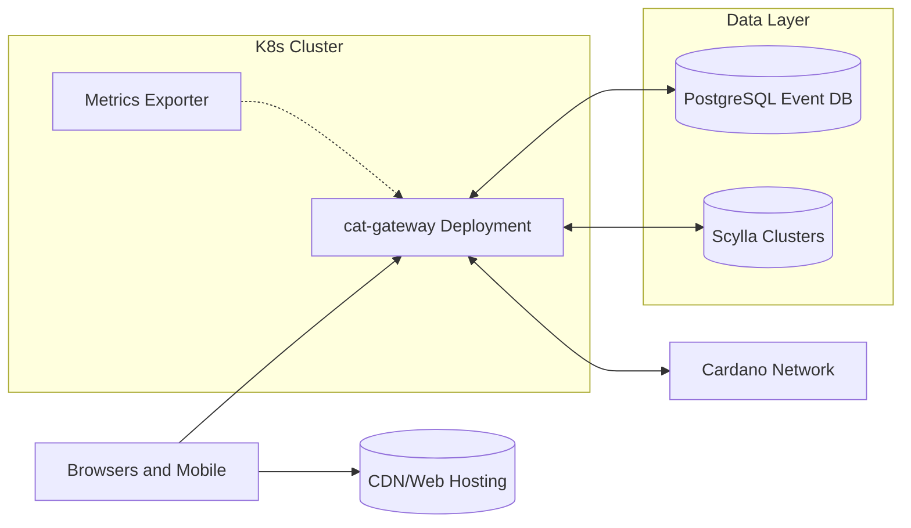

# Deployment View

<!-- See: https://docs.arc42.org/section-7/ -->

## Infrastructure Level 1

High level deployment uses containerized services for the gateway and data stores with public HTTPS endpoints.

Motivation:

Kubernetes enables rolling updates, horizontal scaling, and isolation of concerns across services.

Quality and performance features:

* Separate read heavy workloads to Scylla backed endpoints.
* Keep API stateless behind load balancers with sticky free scaling.
* Expose Prometheus metrics and health probes for automated rollouts.

Mapping of building blocks to infrastructure:

* Gateway binary runs as a container exposing HTTP API and metrics ports.
* PostgreSQL hosts event data with backups and PITR configured by SRE.
* Scylla clusters, which are Cassandra compatible, provide persistent and volatile keyspaces for chain caches.
* Flutter Web builds are served via CDN and app stores deliver mobile builds.

## Infrastructure Level 2

### Networking

* Public HTTPS for API with restrictive CORS and rate limits per route group.
* Private networking between gateway pods and data stores with TLS.
* Separate metrics endpoint scraped by Prometheus and dashboards in Grafana.
* Gateway peers with the Cardano network using the Node-to-Node (N2N) protocol and does not use HTTP or gRPC bridges.

### Build and Release

* Earthly pipelines produce Docker images and OpenAPI artifacts.
* Canary deployments test new versions before rolling fleet upgrades.
