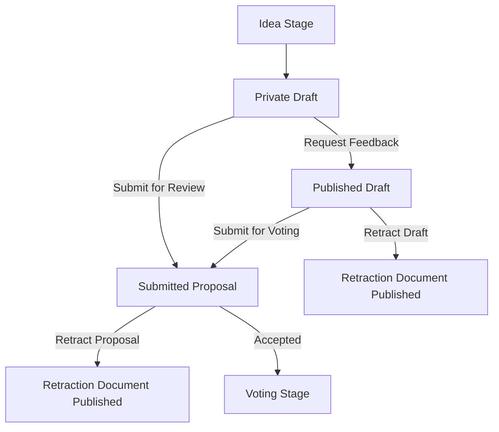

# **Entity Identity Card**

---

## **Proposal**

---

### **Entity Name & Purpose**

| **Aspect**       | **Description**                                                                                                            |
| ---------------- | -------------------------------------------------------------------------------------------------------------------------- |
| **Name**         | Proposal                                                                                                                   |
| **Purpose/Role** | Represents a user-submitted funding proposal containing responses to predefined questions outlined in the proposal schema. |
| **Scope**        | User generated and owned data. Owner is required to make the data public in order to participate in a fund                 |

---

### **Ownership & Control**

| **Aspect**             | **Decision**    | **Guidance/Notes**                                                                                                                                                          |
| ---------------------- | --------------- | --------------------------------------------------------------------------------------------------------------------------------------------------------------------------- |
| **Data Owner**         | User            | Users own their Proposal data and retain control over its content                                                                                                           |
| **Controller**         | User            | Users control the cryptographic keys required for Proposal updates, encryption, and access, users must make the data publicly accessible in order to participate in a fund. |
| **Permissions**        | Consent Based   | Users must explicitly publish their Proposals to make them accessible; drafts remain private unless explicitly shared.                                                      |
| **Storage Controller** | User-Determined | Users determine the storage provider. Storage provider must be publicly accessible at all times.                                                                            |

---

### **Schema & Lifecycle**

| **Aspect**            | **Decision**                 | **Guidance/Notes**                                                                                                            |
| --------------------- | ---------------------------- | ----------------------------------------------------------------------------------------------------------------------------- |
| **Schema Stability**  | Fixed per Fund Round         | Proposal schema is fixed per funding round, ensuring fairness across all proposal submissions.                                |
| **Versioning**        | Linked Records               | Updates to Proposals create new records linked to previous versions, preserving historical integrity.                         |
| **Version History**   | Indefinite                   | All historical versions remain accessible for transparency and traceability.                                                  |
| **Lifecycle Stages**  | Draft → Published → Archived | Drafts are private, published Proposals are accessible for evaluation, and archived Proposals remain available for reference. |
| **Validation Rules**  | Strict                       | Validation is enforced via the ProposalSchema, ensuring compliance with predefined question sets and data types.              |
| **Required Fields**   | Yes                          | All required fields, as defined by the ProposalSchema, must be completed for a valid submission.                              |
| **Expected Lifespan** | Long-lived                   | Proposals exist until the funding round is completed, with archival for historical reference.                                 |
| **Archival Needs**    | Indefinite                   | Archived Proposals remain accessible indefinitely for accountability and future reference.                                    |

---

### **Visibility & Storage**

| **Aspect**             | **Decision**                       | **Guidance/Notes**                                                                                                                                                                                        |
| ---------------------- | ---------------------------------- | --------------------------------------------------------------------------------------------------------------------------------------------------------------------------------------------------------- |
| **Public vs Private**  | Hybrid                             | Drafts are private, and published Proposals become public on submission, drafts can be made public but then can no longer transition to private.                                                          |
| **Storage Location**   | User-Determined                    | Users store Proposals on decentralized storage solutions (e.g., IPFS/Filecoin). For fund 14 Catalyst will provide a storage mechanism for proposal storage                                                |
| **Public Persistence** | Catalyst (Time boxed)              | Proposals are made persistent on IPFS or similar decentralized storage systems for long-term availability. For fund 14 Catalyst will provide a storage mechanism for proposal storage                     |
| **Data Impermanence**  | User and dApp share responsibility | Users are responsible for re-pinning data or updating references if storage nodes fail, the dApp should handle unavailable data gracefully. There must be a way to log this type of issue when it happens |

---

### **Access & Security**

| **Aspect**               | **Decision**              | **Guidance/Notes**                                                                                                             |
| ------------------------ | ------------------------- | ------------------------------------------------------------------------------------------------------------------------------ |
| **Encryption**           | Optional                  | Users can choose to encrypt their drafts. Final submissions must remain unencrypted to allow public evaluation.                |
| **Encryption Key Owner** | User                      | Users hold the cryptographic keys for Proposal encryption and access when in draft state.                                      |
| **Consent Rules**        | Time-bound                | Users must publish their Proposals by the submission deadline to grant access; drafts remain private unless explicitly shared. |
| **Traceability**         | Historical Linked Records | Immutable records of all changes are maintained for accountability and transparency.                                           |

---

### **Integration & Rules Enforcement**

| **Aspect**                             | **Decision**                                                                                             | **Guidance/Notes**                                                                                                            |
| -------------------------------------- | -------------------------------------------------------------------------------------------------------- | ----------------------------------------------------------------------------------------------------------------------------- |
| **Mandatory Participation Conditions** | Must be public by submission deadline, All mandatory questions must be complete as defined by the schema | Users must publish their Proposals before the deadline to participate in funding rounds. No late submissions will be accepted |
| **Non-Compliance Consequences**        | Disqualified from current fund                                                                           | Proposals not submitted by the deadline or non-compliant with ProposalSchema rules are ignored.                               |
| **Validation Mechanism**               | dApp Enforcement                                                                                         | Proposals are validated against the ProposalSchema and compliance with rules validated by moderators                          |

---

### **Relationships**

| **Source Entity** | **Target Entity** | **Relationship Type** | **Cardinality** (Source → Target) | **Cardinality** (Target → Source) | **Description**                                                                  |
| ----------------- | ----------------- | --------------------- | --------------------------------- | --------------------------------- | -------------------------------------------------------------------------------- |
| Proposal          | ProposalSchema    | Depends On            | 1..1                              | 0..*                              | Each proposal requires one schema. A schema can be used by many proposals.       |
| Proposal          | Fund              | Depends On            | 1..1                              | 0..*                              | Each proposal is associated with one fund. A fund can support many proposals.    |
| Proposal          | Category          | Depends On            | 1..1                              | 0..*                              | Each proposal belongs to one category. A category can group many proposals.      |
| Proposal          | Comment           | Is Depended By        | 0..*                              | 1..1                              | A proposal can have zero or many comments. Each comment is tied to one proposal. |
| Proposal          | Vote              | Is Depended By        | 0..*                              | 1..1                              | A proposal can have zero or many votes. Each vote is tied to one proposal.       |

---

### **Regulatory & Compliance Considerations**

| **Aspect**             | **Decision**          | **Guidance/Notes**                                                                                                                                                                                                                 |
| ---------------------- | --------------------- | ---------------------------------------------------------------------------------------------------------------------------------------------------------------------------------------------------------------------------------- |
| **Data Liability**     | User                  | Users are responsible for ensuring compliance with applicable regulations. Proposal data is referenced by Catalyst, for Fund 14 Catalyst will store the proposals but the long term intention is this is the Owners responsibility |
| **Regulatory Impacts** | Minimal Data Enforced | Only necessary data is collected, minimizing regulatory exposure.                                                                                                                                                                  |
| **Data Removal**       | Append-Only           | Data cannot be deleted but can be superseded with updated records to maintain integrity.                                                                                                                                           |

---

### **Financial Considerations**

| **Aspect**              | **Decision**    | **Guidance/Notes**                                                                               |
| ----------------------- | --------------- | ------------------------------------------------------------------------------------------------ |
| **Cost Bearer**         | User            | Users pay for storage services like IPFS pinning.                                                |
| **Cost Bearer Fund 14** | Catalyst        | Catalyst will store the data for fund 14                                                         |
| **Third-Party Storage** | No / Yes        | This is not an option for fund 14 but will be in the future so must be considered                |
| **Funding  Method**     | Catalyst / User | Catalyst will fund storage for fund 14, following this it may be the responsibility of the Owner |

---

### **Security and Privacy Handling**

| **Aspect**           | **Description**                                                                                                                         |
| -------------------- | --------------------------------------------------------------------------------------------------------------------------------------- |
| **Sensitive Data**   | Proposals may include personal data or the proposer or confidential business information.                                               |
| **Privacy Measures** | Drafts can be encrypted; public submissions are open and unencrypted.                                                                   |
| **Risk Mitigation**  | Clear user guidelines for key management, data storage responsibilities, and optional encryption should be communicated with proposers. |

---

### **Languages and Localization**

|**Aspect**|**Description**|
|---|---|
|**Supported Languages**|English, with localization capabilities for additional languages as needed.|
|**Localization Needs**|Users may provide localized content for Proposals; UI localization is supported where feasible.|

---

### **Licensing and Reuse**

* Proposals are user-owned; currently no conditions for licensing are set by Catalyst, it is the responsibility of the proposer to
  ensure they comply with applicable Trademark and Copyright laws.

---

### **Metadata Attributes**

Metadata Attributes are defined in the header of each document, common metadata attributes can appear on every document,
 entity metadata attributes are those which have a specific meaning to the current entity.
While they can share a common name across entities their purpose may differ from entity to entity.

#### Common metadata attributes

| **Attribute** | **Required** | **Type**                 | **Category**       | **Description**                                                       | **Constraints**                                                                                                         | **Notes**                                        |
| ------------- | ------------ | ------------------------ | ------------------ | --------------------------------------------------------------------- | ----------------------------------------------------------------------------------------------------------------------- | ------------------------------------------------ |
| `id`          | Yes          | UUID                     | Unprotected header | Unique identifier for the entity                                      | Primary Key                                                                                                             | Ensures global uniqueness for the entity.        |
| `ver`         | Yes          | ULID                     | Unprotected header | Version ID for the Proposal                                           | The initial ver assigned when published will be identical to the `id`                                                   | Enables versioning and traceability.             |
| `alg`         | Yes          | String                   | Unprotected header | Indicates the cryptography algorithm used for the security processing | It must be equal to EdDSA value.                                                                                        |                                                  |
| `type`        | Yes          | ULID or CBOR Array       | Unprotected header | Indicates the content type of the COSE payload                        | Define Media Types from IANA where possible [Reference](https://www.iana.org/assignments/media-types/media-types.xhtml) |                                                  |
| `encoding`    | Yes          | ULID or CBOR Array       | Unprotected header | Indicate the content encoding algorithm of the payload                | Current supported encoding algorithms: br - Brotli compressed data.                                                     |                                                  |
| `kid`         | Yes          | UTF-8 encoded URI string | Protected header   | A unique identifier of the signer.                                    | Each Catalyst Signed Document COSE signature must include the following protected header field                          |                                                  |
| `ref`         | Optional     | ULID or CBOR Array       | Reference          | References related entities                                           | Linked Record Constraint                                                                                                | `[<id>, <ver>]` format for version linking.      |
| `ref_hash`    | Optional     | ULID or CBOR Array       | Security           | This is a cryptographically secured reference to another document.    | Cryptographically secured Linked Record Constraint                                                                      | Hash of the referenced document CBOR bytes       |
| `template`    | Yes          | ULID or CBOR Array       | Reference          | Template guiding the entity structure                                 | Must reference an existing Template entity                                                                              | `[<id>, <ver>]` ensures traceable references.    |
| `reply`       | Optional     | CBOR Array               | Reference          | Identifies the entity this is replying to                             | Optional; `[<id>, <ver>]` format                                                                                        | Typically used for comments or discussions.      |
| `section`     | Optional     | JSON Path                | Reference          | Links to a specific section of a document                             | Must comply with valid JSON Path syntax                                                                                 | Useful for granular referencing within payloads. |
| `collabs`     | Optional     | CBOR Array               | Security           | Authorized collaborators for the entity                               | Must be valid collaborator address                                                                                      | Ensures multi party editing is traceable.        |

#### Entity metadata attributes

| **Attribute** | **Type** | **Category**      | **Description**                                                            | **Constraints**                                                                            | **Notes**                                               |
| ------------- | -------- | ----------------- | -------------------------------------------------------------------------- | ------------------------------------------------------------------------------------------ | ------------------------------------------------------- |
| `campaign_id` | UUID     | Additional Fields | Unique identifier of the category the proposal has been published to       | Existing UUID of category, category `brand_id` MUST be the same as the proposal `brand_id` | Ensures each proposal is only published to one category |
| `brand_id`    | UUID     | Additional Fields | Unique identifier of the brand under which the proposal has been submitted | Existing UUID of brand                                                                     | Used for quick lookups on indexes                       |

---

### **Attributes**

Entity specific attributes that will appear in the document body.

| **Attribute**    | **Type** | **Required** | **Description**               | **Constraints**                         | **Notes**                             |
| ---------------- | -------- | ------------ | ----------------------------- | --------------------------------------- | ------------------------------------- |
| `title`          | String   | Yes          | Display name for the proposal | Max Length: 255                         | Shown in interfaces for user context. |
| `description`    | String   | Optional     | Summary of the proposal       | Optional, Max Length: 1000              | Displayed as UI/UX content.           |
| `requestedFunds` | Yes      | Presentation | Requested amount in ADA       | Between: 15,000-2,000,000 ADA inclusive |                                       |
| `duration`       | Yes      | Presentation | Project duration in months    | Between 2 and 12 inclusive              |                                       |

---

### **Actions**

This section defines the actions that can be performed on the entity, the entities that can perform the action and any
 constraints placed on the action

| **Operation**           | **Action owner**                     | **Inputs**                                | **Constraints**                                                                            | **Expected Output**                                                                         | **Output Owner**             | **Additional Notes**                                                                                             |
| ----------------------- | ------------------------------------ | ----------------------------------------- | ------------------------------------------------------------------------------------------ | ------------------------------------------------------------------------------------------- | ---------------------------- | ---------------------------------------------------------------------------------------------------------------- |
| **Create**              | Proposer (owner)                     | Register proposer                         | Proposer must have registered with Catalyst                                                | New proposal document created and assigned a unique ID. (Proposal Document)                 | Proposal creator now `Owner` | Proposal ownership is initially assigned to the creator; metadata includes creation timestamp.                   |
| **Proposal Submission**             | Proposal owner or collaborator       | Proposal ID                               | Proposal must be complete and pass validation                                              | Proposal becomes visible and active  (Proposal Publish Action Document)                     | Proposal Owner               | Transition from draft to public; ensures proposal adheres to all formatting and content guidelines.              |
| **Retract**             | Proposal owner or collaborator       | Proposal ID, reason for retraction        | Restricted to owner; may not retract proposals in active voting or funding phases          | Proposal is marked as retracted; becomes inactive (Proposal Retraction Action Document)     | Proposal Owner               | Retracted proposals remain in the system for record keeping but are excluded from future processes.              |
| **Comment**             | User with role 0 key                 | Proposal ID, comment text                 | User must have commenting permissions; content must adhere to community guidelines         | Comment linked to the proposal   (Comment Document)                                         | Comment creator              | Comments are public documents tied to the proposal; responsibility for the lifecycle remains with the commenter. |
| **Vote**                | Users who have registered for voting | Proposal ID, vote type (Yes, No, Abstain) | User must belong to an eligible voter group; voting period must be active                  | (Vote Document)                                                                             | Voter                        | Voting results are tied to the proposal; individual votes remain private unless explicitly disclosed.            |
| **Review**              | Assigned reviewers                   | Proposal ID, review feedback              | User must be assigned as a reviewer; review criteria must be satisfied                     | Proposal enters reviewed state with feedback    (Review Document)                           | Reviewer                     | Review documents are tied to the proposal but owned by the reviewer, who is responsible for feedback accuracy.   |
| **Approve**             | Assigned reviewers                   | Proposal ID, approval decision            | Restricted to authorized reviewers; approval may require a consensus                       | Proposal is approved and progresses to the next phase   (Approved Action Document)          | Moderator / Catalyst         |                                                                                                                  |
| **Reject**              | Assigned reviewers                   | Proposal ID, rejection reason             | Restricted to authorized reviewers; rejection reason must be provided                      | Proposal is rejected   (Rejected Action Document)                                           | Moderator / Catalyst         | Rejected proposals may be revised and resubmitted depending on system fund policies.                             |
| **Fund**                | Funding authority                    | Proposal ID, funding amount               | Proposal must have met all criteria for funding; funding pool must have sufficient balance | Proposal is marked as funded; funds are allocated   (Funded Action Document)                | Moderator / Catalyst         |                                                                                                                  |
| **Add Collaborator**    | Proposal owner                       | Proposal ID, collaborator ID              | Collaborator must have an active account and accept the invitation                         | Collaborator gains access to the proposal and may contribute (Collaborator Action Document) | Proposal Owner               | Added collaborators inherit specific permissions tied to their role in the proposal.                             |
| **Remove Collaborator** | Proposal owner                       | Proposal ID, collaborator ID              | Collaborator must already be associated with the proposal                                  | Collaborator's access is revoked  (Collaborator Revocation Action Document)                 | Proposal Owner               | Removed collaborators can no longer perform actions on the proposal document                                     |

---

### **Workflow**

1. **Idea Stage**
    * Content is private and informal.
2. **Private Draft**
    * Fully editable.
    * Possible actions:
        * Request feedback → Moves to **Published Draft**.
        * Submit for review → Moves to **Submitted Proposal**.
3. **Published Draft**
    * Proposal is shared publicly for feedback.
    * Visible to all users in the Discovery Space.
    * Fully editable by authors.
    * Possible actions:
        * Retract draft → Publish a retraction document.
        * Submit for voting → Moves to **Submitted Proposal**.
4. **Submitted Proposal**
    * Proposal is finalized and submitted for review.
    * Locked for edits.
    * Visible to all users.
    * Possible actions:
        * Retract proposal → Publish a retraction document.
    * Possible outcomes:
        * **Accepted**: Moves to voting stage.
5. **Voting Stage**
    * Accepted proposals are presented for voting.
    * Locked and visible to voters.

---

### **Error Handling**

#### **Submission Errors**

* **Issue**: Users submit incomplete or invalid Proposals that do not conform to the Proposal Schema.
* **Detection**:
  * Validation is performed locally in the Catalyst interface against the Proposal Schema.
* **Handling**:
  * Notify users immediately of validation failures with descriptive error messages, e.g., "Field X is missing" or
  "Invalid format for Field Y."
  * Provide actionable suggestions or links to guidelines.

#### **Storage Errors**

* **Issue**: Data becomes inaccessible due to node failure or unpinned content or api issues
* **Detection**:
  * Validate the data is accessible on the Catalyst interface.
* **Handling**:
  * Notify users of inaccessible data with recommendations.

#### **Versioning Conflicts**

* **Issue**: Users inadvertently create conflicting versions of the same Proposal by submitting multiple updates simultaneously.
* **Detection**:
  * Conflicts should be detected during submission by comparing version ULID
* **Handling**:
  * Notify users of conflicts and provide options to resolve them:
    * "Retain most recent version."
    * "Merge changes manually."
    * "Discard specific updates."
  * Implement automatic conflict resolution rules, such as prioritizing updates with the latest timestamp.

#### **Access / Retrieval Errors**

* **Issue**: Users or reviewers encounter access issues due to incorrect permissions or expired links.
* **Detection**:
  * Catalyst interface should detect access errors as they occur.
* **Handling**:
  * Notify users of permission issues with clear instructions on how to proceed.
  * Log the issue for operational and audit purposes.

#### **User-Generated Errors**

* **Issue**: Users make mistakes such as incorrect data entries or submission of incomplete drafts.
* **Detection**:
  * Front end validation catches errors before data is submitted
* **Handling**:
  * Auto-save drafts locally with periodic prompts to review and finalize.

---

### **Key Risks and Mitigation Strategies**

#### **Risk 1: User Loses Encryption Keys**

* **Issue**: If a user encrypts their Proposal and loses their private key, the Proposal becomes inaccessible.
* **Impact**:
  * **Proposal Inaccessibility**: The Proposal cannot be decrypted, effectively rendering it unusable for evaluation or funding.
  * **Dependency Impact**: Comments or other entities referencing the Proposal can not reference private drafts and therefore will
  have no impact on their context and relevance.
* **Mitigation**:
  * **Key Backup**:
    * Encourage users to store backup keys securely using a trusted wallet or key management service.
  * **Transparent Submission**:
    * Enforce public non encrypted final submissions to ensure Proposals are accessible to evaluators.
* **Result**: Reduces total data loss risk while preserving decentralized ownership principles.

#### **Risk 2: Entity Disappears (Data Loss)**

* **Issue**: A Proposal stored on decentralized storage becomes permanently inaccessible (e.g., due to node failures or
  insufficient pinning).
* **Impact**:
  * **Proposal Loss**: Funding decisions cannot be made if Proposals are lost.
  * **Dependency Impact**: Comments, reviews, and votes lose their reference, creating orphaned records.
* **Mitigation**:
  * **Redundant Storage**:
    * Encourage users to pin their Proposal on multiple nodes .
  * **Backup References**:
    * Maintain metadata logs with Proposal content hashes and alternative storage for recovery.
* **Result**: Minimizes the impact of missing data and ensures continuity for dependent entities.

#### **Risk 3: User Fails to Pay Storage Costs**

* **Issue**: If users fail to pay for storage, their Proposal may be deleted or become inaccessible.
* **Impact**:
  * **Proposal Inaccessibility**: Without storage, Proposals cannot be evaluated or referenced.
  * **Dependency Impact**: Comments and votes referencing the Proposal lose their association.
* **Mitigation**:
  * **Cost Transparency**:
    * Provide users with clear estimates of storage costs during Proposal creation.
  * **User Notifications**:
    * Notify users of impending storage expiry and issues.
  * **Default Migration**:
    * Automatically migrate unpaid Proposals to a shared storage archive with time boxed removal if storage remains unpaid.
* **Result**: Ensures Proposals remain available while balancing user responsibility for cost of ownership.

#### **Risk 4: Regulatory Non-Compliance**

* **Issue**: Proposals contain data violating GDPR, CCPA, or other laws or regulations.
* **Impact**:
  * **Penalties**: The data owner may face fines or restrictions due to non-compliance with regulations.
  * **Operational Risks**: Catalyst risks operational disruptions and loss of trust.
* **Mitigation**:
  * **Minimal Data Collection**:
    * Restrict Proposals to predefined questions, ensuring compliance with data minimization principles.
    * Ensure that any data with a Sensitivity Type defined is owned, stored and controlled by the user.
  * **Encryption Options**:
    * Allow users to encrypt sensitive data to comply with privacy regulations.
  * **Retention and Removal**:
    * Implement automated archival processes for expired or retracted Proposals to reduce regulatory exposure.
* **Result**: Ensures that Catalyst remains compliant with global data privacy regulations.

#### **Risk 5: Non Compliance with Catalyst Rules**

* **Issue**: Users fail to adhere to Catalyst defined rules (e.g., not publishing their Proposal by the deadline).
* **Impact**:
  * **Disqualification**: Non compliant Proposals are excluded from funding consideration.
* **Mitigation**:
  * **Early Notifications**:
    * Provide users with real time progress tracking and reminders about submission deadlines.
  * **Education and Support**:
    * Include clear documentation to guide users through the application process.
* **Result**: Encourages compliance while reducing friction in user interactions.

---

## Open Issues

* N/A

---

### **Iteration Change Log**

| **Version** | **Date**   | **Description of Change**                       | **Author**     |
| ----------- | ---------- | ----------------------------------------------- | -------------- |
| v1.0        | 2024-12-20 | Initial creation of the Proposal Identity Card. | Neil           |
