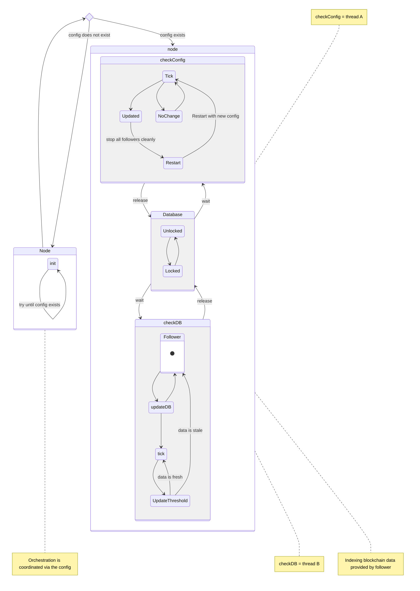

# Initial blueprint

```mermaid
  stateDiagram-v2
    state if_state <<choice>>
    Node -->if_state
    if_state --> node : config exists
    if_state --> Node: config does not exist


    note right of node
            Indexing blockchain data provided by follower
        end note

    
    note left of node
            checkConfig = thread A
        end note

    
    note right of node
            checkDB = thread B
        end note

    
    note right of Node
            Orchestration is coordinated via the config
        end note

    state Node {
        init --> init: try until config exists
    }

    state Follower {
        [*]
    }

    state node {
        checkConfig-->Database: release
        Database-->checkConfig: wait

        checkDB-->Database: release
        Database-->checkDB: wait

        State checkConfig{
            Tick --> Updated
            Tick --> NoChange: 
            Updated --> Restart: stop all followers cleanly
            Restart --> Tick: Restart with new config
            NoChange--> Tick
        }
        State checkDB{
            tick --> UpdateThreshold
            UpdateThreshold --> tick: data is fresh
            UpdateThreshold--> Follower: data is stale
            updateDB --> tick
            updateDB-->Follower
            Follower -->updateDB
        }
        state Database{
            Unlocked --> Locked
            Locked--> Unlocked
        }
    }
```

:construction: Design is still active and not final :construction:
