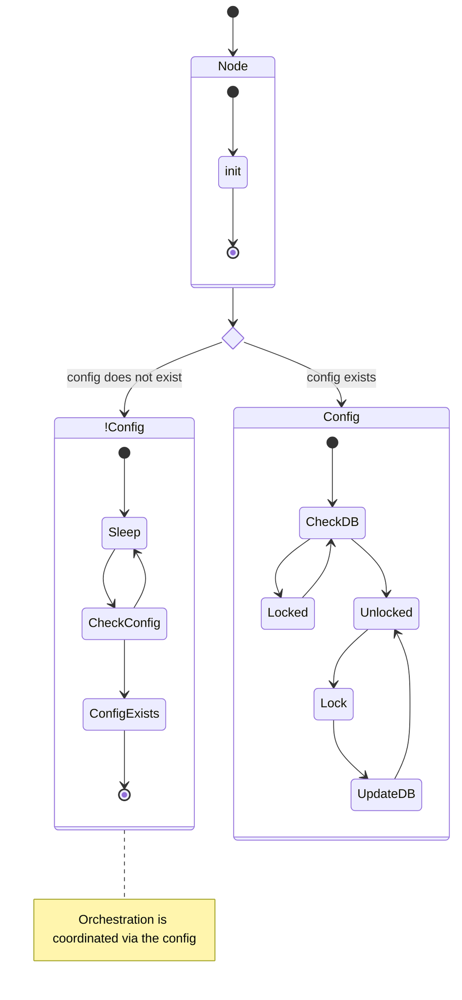

## Mechanics

## Bootstrap

- cli
- specified networks 

## Config 
- check if config exists or in use

## Obtain network metadata

- specified network (slot epoch)

## Syncing

## Contention

## Multiple nodes

## Roll backs