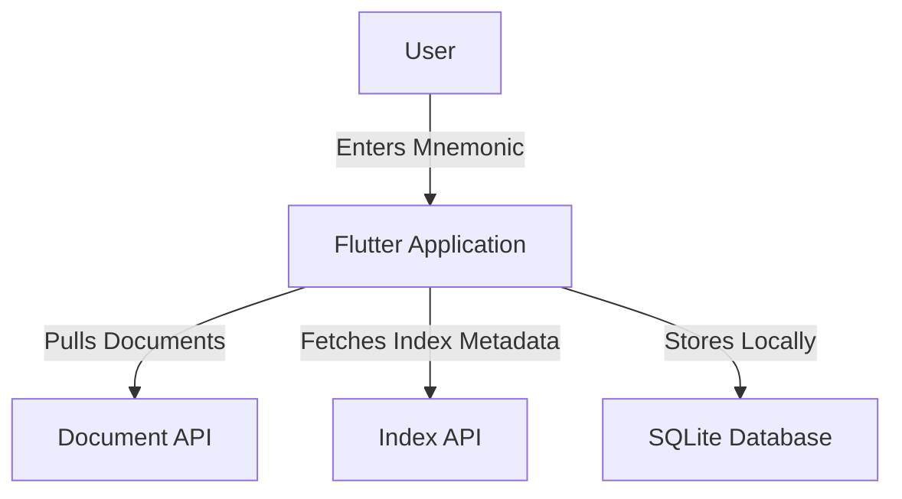
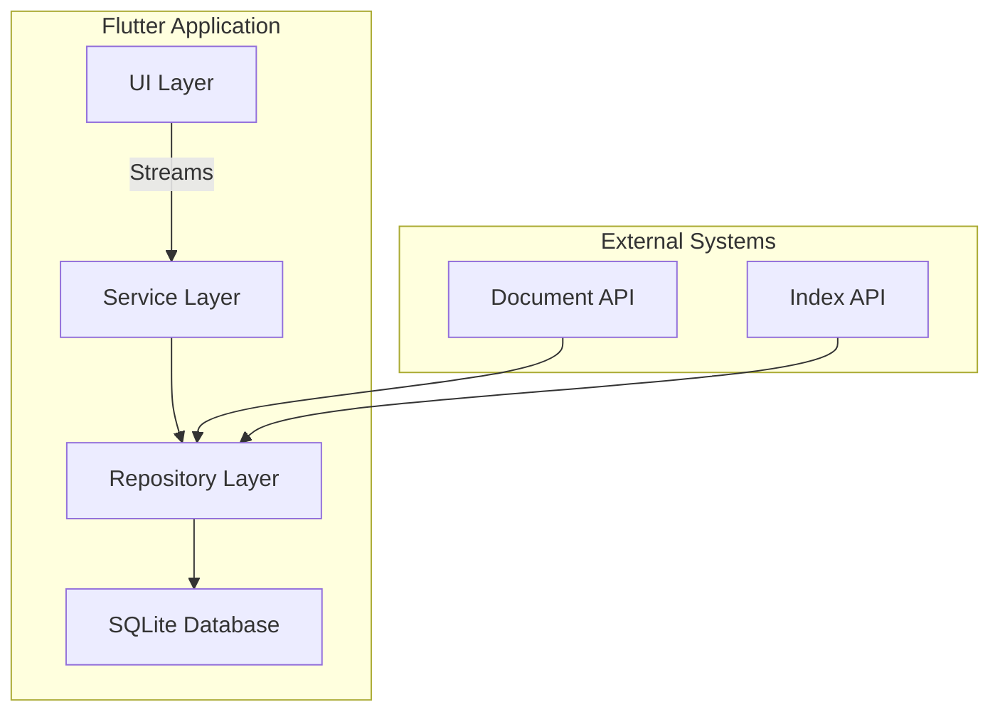
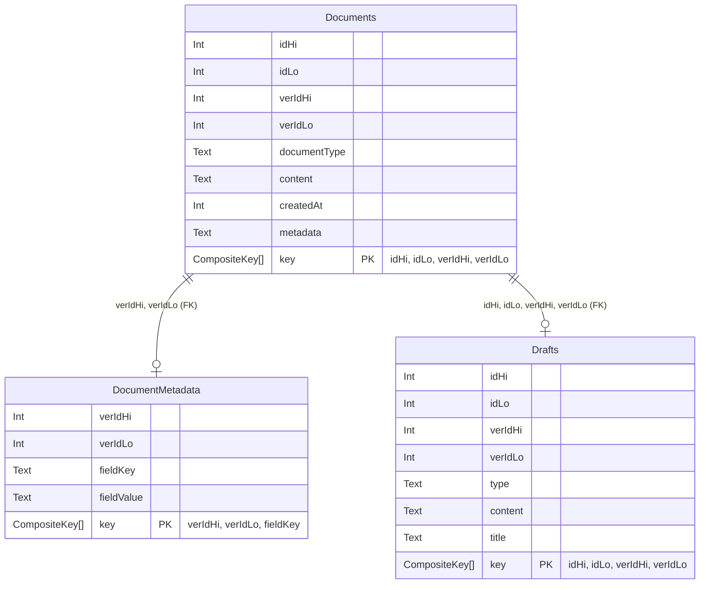

# Local Storage Architecture Specification - Fund 14 Requirements Focus

Version: 1.1 January 2025

---

| Version | Date       | Author         | Summary of Changes       | Notes            |
| ------- | ---------- | -------------- | ------------------------ | ---------------- |
| 1.0     | 2025-01-27 | Neil McAuliffe | Initial draft            |                  |
| 1.1     | 2025-01-31 | Neil McAuliffe | Narrow focus for Fund 14 | Clarified scope  |

---

[TOC]

## 1 Summary

This document defines the architecture for implementing a cross-platform local storage solution for Catalyst with specific focus on
the requirements for Fund 14 The primary objectives include managing JSON documents, supporting UI updates, ensuring data security,
managing local draft document creation and laying a foundation for scalable and future-proof storage practices.

The solution integrates SQLite with JSON support, encryption for sensitive draft data, and Drift for database management and
reactive streams.

## 2 Requirements & Constraints

### 2.1 Functional Requirements

* **Cross-Platform Local Storage**

  * Must support Web, iOS, Android, macOS, Linux, and Windows within a single Flutter codebase.

* **JSON Document Storage & Querying**

  * Utilize SQLite’s JSON1/JSONB functions for efficient querying of JSON-structured documents.

* **UUIDv7-Based Identification**

  * Enforce time-ordered identifiers for both documents and version management.

* **External Document API Integration**

  * Retrieve, index, and post documents to Catalyst backend API however consideration is given to future implementations where
multiple storage options are available.

* **Reactive UI Updates**

  * Rely on Drift ORM streams to automatically update the UI when local data changes.

* **Offline Access & Caching**

  * Provide offline read/write capabilities and cache documents/metadata locally.

* **Document Versioning & Metadata Indexing**

  * Track multiple versions of a document and maintain indexed metadata for fast lookups.

### 2.2 Non-Functional Requirements

* **Performance**

  * Ensure fast read/write operations with indexing for large datasets, local caching of documents is required to avoid requests
to the backend every time a new document is required.

* **Scalability**

  * Design schema and data flows to accommodate future data models, addition of indexes and additional metadata will be enabled
with out significant re-work.

* **Security & Data Integrity**

  * Consider future requirements for encryption of sensitive documents to avoid significant refactoring of solution.

* **Maintainability**

  * Use a service/repository pattern and dependency injection (DI) for clearer separation of concerns, follow best practices of
clean separation of concerns when defining the data layer implementation.

  * Allow future enhancements (e.g., advanced sync logic) without redefining core elements of the local storage.

### 2.3 Constraints & Assumptions

* **SQLite Version Requirement**

  * Requires SQLite 3.38.0+ for JSONB support (or 3.45.0+ for advanced JSON functions).

* **Technology Stack**

  * Drift ORM is used for type-safe queries, reactive streams, and schema migrations.

* **Out of Scope**

  * No built-in device synchronization or complex conflict resolution in this phase.

  * No advanced collaboration features (e.g., CRDTs) are required at this time.
  * Encryption of documents is currently out of scope.
  * Approach assumes the application is not used on shared devices and the account holder is responsible for the management
  of sensitive data, if the application is used on a shared device.

* **Implementation Scope**

  * This phase covers only the architecture proposal and high-level design; no direct code implementation.

* **Existing Flutter Architecture Integration**

  * Must integrate seamlessly with the current Flutter codebase and follow established design patterns.

## 3 System Overview

### 3.1 Key Features

* **Document Storage**

  * JSON documents stored in SQLite with partial metadata extraction for indexing.

  * UUIDv7 ensures time-based ordering for documents and version tracking.

  * Consideration for future support of secure local document storage with version management.

* **Query Performance**

  * Indexed JSON fields and reactive UI updates via Drift streams.

* **Caching**

  * Local caching of frequently accessed data and metadata, supporting offline reads and writes.

### 3.2 Core Components

* **Data Layer**

  * Tables: `documents`, `drafts`, `metadata`.

  * Support for storing UUIDv7 as INT8 pairs (recommended), BLOB, or TEXT.

* **Service Layer**

  * API management for document index retrieval and document actions.
  * Session management and encryption at the service layer is out of scope.

* **UI Layer**

  * Drift ORM for type-safe queries and reactive streams.

  * Automatic UI updates when data changes (e.g., proposals, comments).

### 3.3 System Context and Component Relationship

#### *System Context Diagram*



#### *Component Relationships*



### 3.4 Component Overview

#### 3.4.1 High-Level System Separation

* **Data Layer**:

  * Tables: `documents`, `drafts`, `metadata`.

* **Service Layer**:

  * Repository pattern for database operations.

  * Dependency injection for modularity.

* **UI Layer**:

  * Reactive updates via Drift `Stream` integration.

#### 3.4.2 Data Storage Tables

* **Metadata Table**:

  * Stores extracted fields for querying.

  * Enables UI elements like counts and categories.

  * Updates via index api frequently.

* **Drafts Table**:

  * Stores draft documents not yet submitted and signed by the account owner.

* **Documents Table**:

  * Stores the raw JSON documents pulled from the API.

## 4 Technology Evaluation

### 4.1 Evaluation Criteria

* Compatibility with web, mobile, and desktop platforms

* Ease of integration with Flutter

* Performance metrics (read/write speed, indexing)

* Community support and long-term viability

* Potential for encryption & security features

### 4.2 Comparative Analysis of Storage Solutions

| **Criteria** | **SQLite + Drift** | **Hive** | **Sembast** | **ObjectBox** | **Floor** |
| ---------------------- | --------------------------- | ---------------- | ---------------- | ------------- | ---------------- |
| **JSON Support** | ✅ Native (JSON1/JSONB) | ❌ Manual parsing | ✅ Limited | ❌ No | ❌ Manual parsing |
| **Cross-Platform** | ✅ All targets | ✅ All targets | ✅ All targets | ✅ All targets | ✅ All targets |
| **Query Flexibility** | ✅ SQL + JSON Path | ❌ Key-based | ✅ Basic indexes | ❌ Limited | ✅ SQL (limited) |
| **Reactive Streams** | ✅ Drift `.watch()` | ✅ | ✅ | ✅ | ❌ |
| **Encryption** | ✅ External libraries (Database level) | ✅ Built-in | ❌ External only | ✅ Built-in | ❌ External only |
| **Scalability** | ✅ Proven at scale | ❌ Small datasets | ❌ Small datasets | ✅ High perf. | ❌ Moderate |

**Decision**: SQLite with Drift is selected due to its:

* **JSON1/JSONB Support**: Critical for querying dynamic document fields without rigid schemas.

* **Cross-Platform**: SQLite works seamlessly with Drift on all Flutter targets, including Web.

* **Reactive UI**: Drift streams enable real-time updates (e.g., `Stream<List<Document>>`).

* **Future-Proof**: Aligns with eventual IPFS integration by separating storage and indexing layers.

## 5 Database Design

### 5.1 ER Diagram



#### 5.1.1 `Documents` Table

This table stores a record of each document (including its content and related metadata).

Each row represents a specific version of a document.

* **Primary Key (Composite):** `(idHi, idLo, verIdHi, verIdLo)`

  * These pairs (`idHi`, `idLo`) and (`verIdHi`, `verIdLo`) together uniquely identify a specific document version.

* **Fields:**

  * `documentType` (Text): Indicates the high-level type or category of the document defined by Catalyst.

  * `content` (Text): The main JSON or raw text of the document itself.

  * `createdAt` (Int): Timestamp or epoch to record when this document version was created.

  * `metadata` (Text): Inline metadata (often JSON) that may be needed alongside the main content.

* **Indexes:**

  * `idx_unique_ver_id` (UNIQUE on `verIdHi, verIdLo`): Ensures the version ID pair is unique across the table.

#### 5.1.2 `DocumentMetadata` Table

This table breaks out metadata into a key-value structure for each document version, enabling more granular or indexed queries

which are more efficient than querying the JSON content directly.

* **Primary Key (Composite):** `(verIdHi, verIdLo, fieldKey)`

  * Ties each metadata entry to a specific document version and a metadata key.

* **Fields:**

  * `fieldKey` (Text): The name/identifier of the metadata field (e.g., "author", "fund", "category").

  * `fieldValue` (Text): The value corresponding to that field key.

* **Indexes:**

  * `idx_doc_metadata_key_value` on `(fieldKey, fieldValue)`: Speeds up lookups by metadata key/value pairs.

#### 5.1.3 `Drafts` Table

This table holds in-progress (draft) versions of documents that are not yet been made public or submitted.

* **Primary Key (Composite):** `(idHi, idLo, verIdHi, verIdLo)`

  * Matches the document identifier plus the version identifier, similar to `Documents`.

* **Fields:**

  * `type` (Text): Designation of the draft’s type (e.g., "proposal", "comment").

  * `content` (Text): Local saved draft content.

  * `title` (Text): Human-readable title for quick reference in the UI.

* **Indexes:**

  * `idx_draft_type` on `(type)`: Allows filtering drafts by type.

### 5.2 UUID

SQLite does not have built-in support for UUIDs to use UUIDs we need to store them as either Blobs INT8's.
IDHI/IDLO, or plain text.
Regardless of approach the date time should be extracted from the UUIDv7 document id or version and store in separate column.

Note, UUIDv7 is time-ordered by design therefore ordering is still possible regardless of approach, performance will vary.

#### **Option 1: BLOB Storage**

```sql

CREATE TABLE documents (id BLOB PRIMARY KEY);

```

**Advantages**:

* Direct binary storage (16 bytes).

* No conversion overhead

* Simpler implementation

#### **Option 2: TEXT Storage**

```sql

CREATE TABLE documents (id TEXT PRIMARY KEY);

```

**Advantages**:

* Human-readable for debugging.

* Direct string operations

#### **Option 3: INT8 Pair (Recommended)**

```sql

CREATE TABLE documents (

id_hi BIGINT NOT NULL, -- Upper 64 bits of UUIDv7

id_lo BIGINT NOT NULL, -- Lower 64 bits

PRIMARY KEY (id_hi, id_lo)

);
```

**Advantages**:

* Efficient range queries on timestamp (first 48 bits of `id_hi`).

* Native integer operations

* Smaller storage footprint

* Better indexing performance

The following approach should be taken for handling UUIDv7 Id and Version fields.
Both Id and Version fields should use **two `INT8`
columns (IDHI and IDLO)** rather than storing them as a BLOB or TEXT field, splitting them into two 64-bit integers (`INT8`) has
following advantages:

* **Better Indexing**

  * SQLite indexes `INT` columns efficiently.
  * Splitting UUIDs into two parts enables faster lookups.

* **Range Queries**:

  * With UUIDv7, the first 48 bits of the UUID represent a timestamp.
  * By storing the timestamp portion in one `INT8` column (`IDHI`), you can perform range-based searches.

* **Structured Operations**:
  * Separating the "time" and "random" portions of the UUID simplifies operations like sorting, filtering, and datetime extraction.

UUIDv7 is structured as follows:

* **First 48 bits (Timestamp)**: Milliseconds since Unix epoch.
* **Next 16 bits (Version and Variant)**: Metadata indicating UUID version and variant.
* **Last 64 bits (Random/Entropy)**: Randomly generated for uniqueness.

Spliting the UUIDv7 will align with the following approach:

* `IDHI`: Stores the first 64 bits (timestamp + version/variant).
* `IDLO`: Stores the last 64 bits (random/entropy).

## 6 Implementation

### 6.1 JSON Document Handling

#### 6.1.1 Indexes

For front-end queries where fields are frequently used in a `WHERE` clause, it is recommended to create indexes to improve query
performance.
The overhead of creating these indexes should be evaluated over time based on the volume of data stored in the local
database.
Index creation is most beneficial for tables that store large amounts of data.
The specific fields to index should be
determined based on access patterns and usage, in alignment with UI/UX design.

Front-end engineers may decide to extract certain phrases from the JSON documents on insertion and store these fields in a metadata
table to be indexed, enabling quick lookups and document retrieval.

When using the Drift ORM, indexes are automatically created for certain columns and do not need to be defined manually.
This applies to:

* Primary keys
* Unique columns
* Target columns of a foreign key constraint

Indexes can also be created declaratively in Drift.
For instance, the following code will make queries based on `documentType` more efficient:

```dart
class Documents extends Table {
  IntColumn get idHi => integer()();
  IntColumn get idLo => integer()();
  IntColumn get verIdHi => integer()();
  IntColumn get verIdLo => integer()();
  TextColumn get documentType => text()();
  TextColumn get content => text()();
  IntColumn get createdAt => integer()();
  TextColumn get metadata => text().nullable()();

  @override
  Set<Column> get primaryKey => {idHi, idLo};

 @override
 List<Index> get indexes => [
   Index('document_type_index', [documentType]),
   Index('idx_unique_ver_id', [verIdHi, verIdLo], unique: true),
 ];
}

```

#### 6.1.2 Dynamic Field Indexing for Lookups

To ensure efficient look ups, dynamic indexes can be used to improve query performance.
The JSON document is stored in the primary
`documents` table, and a separate `document_metadata` table is used for quick look ups on specific fields.
This avoids parsing or
scanning the entire JSON document each time to filter or sort by a particular field.

#### 6.1.3 Process and Flow

1. **Insert Document**

   * Insert the entire JSON-based document into the main `documents` table (which contains a composite primary key,
   for example `(idHi, idLo)`).

2. **Parse JSON**

   * Extract the fields you want to index (e.g., `title`, `description`, `category`) immediately after insertion.
   * Use best practices to identify suitable candidates for indexing based on query optimization, UI/UX design, and requirements.

3. **Insert Metadata**

   * Store the extracted field-value pairs in a separate `document_metadata` table that references the `documents` table via a
   foreign key.
   * Each field is stored as a separate row, for example:
     * `(doc_id_hi, doc_id_lo, fieldKey='title', fieldValue='My Title')`
     * `(doc_id_hi, doc_id_lo, fieldKey='category', fieldValue='Tutorial')`
   * You can insert additional fields (like `description`, tags, etc.) as needed.

4. **Search and Query**

   * When a filter or search is required on a particular field (e.g., `category='Development'`), query the `document_metadata`
   table by `(fieldKey, fieldValue)` or use a join with `documents`.
   * This avoids having to search through raw JSON each time.

**Flexible**: You can dynamically extract any fields you find valuable for quick look ups or queries without constantly
modifying the schema.  
**Performance**: Frequent queries on a few fields do not require scanning large JSON documents, as the metadata can be indexed
more efficiently.

> **Note**  
> In SQLite, foreign key references are not enabled by default.
> They must be enabled with `PRAGMA foreign_keys = ON`.

#### 6.1.4 Enabling Foreign Keys in SQLite

Don’t forget to enable foreign keys in SQLite, as they are not enabled by default:

```dart
@override
MigrationStrategy get migration => MigrationStrategy(
  beforeOpen: (details) async {
    await customStatement('PRAGMA foreign_keys = ON');
  },
);
```

#### 6.1.5 Example Drift definition with foreign reference and indexes

```dart
class Documents extends Table {
 IntColumn get idHi => integer()();
 IntColumn get idLo => integer()();

 // Columns are unique together
 IntColumn get verIdHi => integer()();
 IntColumn get verIdLo => integer()();

 TextColumn get documentType => text()();
 TextColumn get content => text()();
 IntColumn get createdAt => integer()();
 TextColumn get metadata => text().nullable()();

 @override    
 Set<Column> get primaryKey => {idHi, idLo, verIdHi, verIdLo};

 @override
 List<Index> get indexes => [
   Index('document_type_index', [documentType]),
   Index('idx_unique_ver_id', [verIdHi, verIdLo], unique: true),
 ];
}


class DocumentMetadata extends Table {
 // Composite key matching the Documents table over version not document fields
 IntColumn get verIdHi => integer().references(Documents, #verIdHi, onDelete: KeyAction.cascade, onUpdate: KeyAction.cascade)();
 IntColumn get verIdLo => integer().references(Documents, #verIdLo, onDelete: KeyAction.cascade, onUpdate: KeyAction.cascade)();

 // e.g. 'category', 'title', 'description'
 TextColumn get fieldKey => text()();

 // The actual value (for category, title, description, etc.)
 TextColumn get fieldValue => text()();

 @override
 Set<Column> get primaryKey => {verIdHi, verIdLo, fieldKey};

 @override
 List<Index> get indexes => [
   Index('idx_doc_metadata_key_value', [fieldKey, fieldValue]),
 ];
}

```

#### 6.1.6 Example search over category

```dart
Future<List<Document>> fetchDocumentsByCategory(String category) {
  final query = (select(documents)
    ..where((doc) => existsQuery(
      select(documentMetadata)
        ..where((m) =>
            m.docIdHi.equals(doc.idHi) &
            m.docIdLo.equals(doc.idLo) &
            m.fieldKey.equals('category') &
            m.fieldValue.equals(category))
    ))
  );

  return query.get();
}

```

### 6.2 UUID Conversion to IOHI / IDLO

To split a UUID into `IDHI` and `IDLO`:

* Convert the UUID into its raw binary representation (16 bytes).
* Split the binary into two 8-byte chunks.
* Convert each chunk into a 64-bit integer.

#### 6.2.1 UUIDv7 Example Handler & Timestamp Extraction

```dart
class UuidV7Handler {
 // Convert UUID to INT8 pairs
 static (int, int) uuidToInts(String uuid) {
  final bytes = hex.decode(uuid.replaceAll('-', ''));
  final high = ByteData.sublistView(bytes, 0, 8).getInt64(0);
  final low = ByteData.sublistView(bytes, 8, 16).getInt64(0);
  return (high, low);
 }

 static DateTime extractTimestamp(int id_hi) {
  final msTimestamp = id_hi >> 16;
  return DateTime.fromMillisecondsSinceEpoch(msTimestamp);
 }
}
```

#### 6.2.2 UUIDv7 Time-Range Query Optimisation

Query `IDHI` directly for range-based filtering in the `Document` table.

```dart
// Time-range query using UUIDv7 high bits
Stream<List<Document>> getDocumentsInTimeRange(DateTime start, DateTime end) {
 final startHigh = start.millisecondsSinceEpoch << 16;
 final endHigh = end.millisecondsSinceEpoch << 16;
 return (select(documents)..where((d) => d.idHi.isBetween(startHigh, endHigh)))
  .watch();
}
```

## 7 Draft Document Management

This section outlines a solution for managing **local drafts** covering requirements for fund 14.

Drafts are documents that are **not yet published** to an external public data store or API or signed by the owner, allowing users
to create and edit content locally.
These drafts are inherently **mutable** and can have numerous iterations in local storage, the number of versions stored should be
managed based on storage needs and requirements from a UX perspective.
Once published all documents are considered immutable, in the public domain and permanently available to others.

This requirement stems from several factors:

1. **Offline Capability**: Users should be able to work on drafts without the need to connect to a server.
2. **Performance**: Local storage reduces latency compared to constant server interactions.
3. **Data Control**: Users maintain control over their data until they choose to publish it.
4. **Future Synchronization**: While out of scope at present, the solution will enable the potential for syncing data across
devices.

### 7.1 Storage Options

While consideration was given to various storage options for drafts, the overall storage solution decision was made in a wider
context and the approach defined here for drafts will align with the previous decision of using SQLite as the local data store with
Drift as the ORM.
Other solutions were considered for draft storage like Hive and IndexedDB however these lacked key features and
support defined at a system level.

### 7.2 Draft Workflow

* **Draft Creation and Editing**:
  * Draft content is kept in plaintext in memory while being edited.
  * When saving, metadata (e.g., title, status) is extracted and stored in specific columns in the drafts table or in the metadata
  table.
  * The main content is stored unencrypted in the drafts table.
* **Accessing Drafts**:
  * The app fetches content from `drafts` table using a combination of document id and version (iteration).
* **Session & Authentication**:
  * All drafts are stored unencrypted in local storage and are not tied to a session therefore drafts will persist across sessions,
  and are not explicitly tied to the users keychain.

### 7.3 Draft Database Design

```dart
class Drafts extends Table {
  // Composite key for document identification
  IntColumn get idHi => integer()();
  IntColumn get idLo => integer()();

  // Unique version identifier for the draft
  IntColumn get verIdHi => integer()();
  IntColumn get verIdLo => integer()();

  TextColumn get type => text()();

  TextColumn get content => text()();

  // Public display name of the document
  TextColumn get title => text()();

  @override
  Set<Column> get primaryKey => {idHi, idLo, verIdHi, verIdLo};

  @override
  List<Index> get indexes => [
    Index('idx_draft_type', [type]),
  ];
}
```

## 8 Offline & Synchronization Strategy

All operations that can be performed locally should be performed locally first.
This ensures low latency, offline functionality,
and better performance by reducing reliance on external APIs.
Synchronization with the server (index API and document API) is
performed intelligently to maintain data consistency without compromising offline usability.

### 8.1 Local-First Operations

* **Key Principle:** Any operation that can operate on local cached data should do so first.
* **Operations That Should Be Supported Locally:**
  * Creating new drafts.
  * Editing existing drafts.
  * Viewing cached documents.
  * Querying local metadata for document lists or details.
* **Fallback:** For operations where the required data is not available locally, fetch the necessary document or index data from
  the API and update the local cache.

### 8.2 Document Retrieval Workflow

* **When Requesting a Document (By ID or ID and Version):**
  * **Check Local Cache:**
    * If the document request is available locally **and the request includes a version**, the document is returned from the
      local cache.
  * **If Only an ID is Provided (No Document Version Specified):**
    * If no version is specified in the request, there is no way to determine if any document version stored in the local cache
      is the latest version therefore a request to the api is required to get the documents metadata and list of versions.
    * **Query the Index API** to fetch the full version history of the document.
    * Update the local metadata cache with the latest version info.
    * If the latest version is not cached locally:
      * Fetch the latest version from the document API.
      * Cache it locally for future access.
      * Return the latest version to the user.
  * **If ID and Version Are Provided:**
    * Check if the specified version exists locally.
    * If not found, fetch it from the document API and cache it locally.

### 8.3 Index API Usage

* **Purpose:** The index API is used to retrieve metadata about documents, such as available document IDs, versions, and other
  attributes.
* **Triggers for Index API Calls:**
  * On application startup if the client is online: Perform an initial lightweight sync to ensure the required metadata is up to
    date.
  * (Optional with performance consideration) Periodically in the background: Configurable intervals ensure ongoing metadata
    synchronisation.
  * On user request: Explicit refreshes initiated by the user.
  * When a document is requested by ID only and the local cache cannot verify its latest version.
* **Filtered Queries:** The index API can return metadata for a subset of documents to minimize bandwidth and local storage usage.

### 8.4 Draft Management

* **Local-Only Drafts:**
  * Drafts are created and stored exclusively in the **local drafts table**.
  * Changes to drafts are not synced to the server until explicitly published as a final document.
* **Draft Synchronization:**
  * On publication, the draft is sent to the document API.
  * If the publication succeeds:
    * The draft can be stored in the regular documents table, as the document owner and the user of the client are the same new
    versions of the document can be edited and stored in the draft table however the draft must be signed and published again
    if it is to supersede a previous version.
    * Local metadata is updated with the published version info.
  * If the publication fails:
    * The draft remains in the drafts table.
    * Notify the user of the failure and allow retry upon regaining connectivity.
  * If an older draft is edited locally and saved it will get a new version id, this will become the latest version in the local
    draft database, if this draft is published it will supersede the previously published version even if it does not contain all of
    the data from the previous public version, the responsibility for draft management and versioning is the responsibility of the
    document owner.

### 8.5 Version Management

* **UUIDv7 for Versions:**
  * Document versions are identified using UUIDv7, which encodes a timestamp for chronological ordering.
  * This allows efficient sorting and comparison of document versions.
* **Version Lookup:**
  * If a document is requested **without specifying a version**, the index API must be queried to retrieve the full version
    history of the document.
  * The latest version in the metadata is compared against the locally cached version:
    * If the latest version is not cached locally, fetch it from the document API and update the cache.
* **Conflict Prevention:**
  * Always rely on the latest version metadata from the index API when there’s uncertainty about the latest version.

### 8.6 Conflict Resolution

* **Published Documents:** Always defer to the latest version retrieved from the server.
* **Drafts:** A last-write-wins strategy (new version id) is applied locally, using timestamps from UUIDv7 to determine the most
  recent change, collaborative or cross device conflict resolution is out of scope at present.

### 8.7 Offline Mode

* **Offline Capability:** All local operations, such as creating, editing drafts, and querying cached data, continue to function
  without network connectivity.
* **Queuing Failed Requests:**
  * API requests (e.g., fetches, publications) that fail due to connectivity issues can be queued, however the queue should be
    limited in size and only used for requests relating to the operation of the client, for example requesting the latest
    `Category Parameters Document`
  * Upon reconnecting to the network, queued requests are processed in order.
* **Fallback Retrieval:** If a document isn’t cached locally during offline mode, display an error or notify the user of the need
  to reconnect.

### 8.8 Client metadata bootstrap

* **Fixed document definitions**
  * Catalyst defines fixed document types and identifiers, these type ids will not change and can be used to identify the
    latest documents required to bootstrap a client.
    Examples include, the `Brand Parameters Document`,
    `Campaign Parameters Document`, `Category Parameters Document`.
  * The ids of these document types can be used to pull the latest documents from the API when boot strapping the client and
    performing initial local caching operations.
  * A list of document types and specifications can be
    found [here](https://input-output-hk.github.io/catalyst-libs/architecture/08_concepts/signed_doc/types/)

### 8.9 Background Synchronisation (Optional)

* **Consideration:** Before implementing any background synchronisation consider if it is necessary and if the same result can be
  achieved using explicit requests when required.
* **Purpose:** Keep local metadata and document caches up to date while minimizing bandwidth and performance considerations.
* **Sync Triggers:**
  * Periodic intervals (configurable by the user).
  * Application startup.
  * Explicit user action (manual refresh).
* **Lightweight Syncing:**
  * Fetch only critical metadata updates (e.g., new document versions, added documents).
  * Avoid unnecessary retrieval of documents already cached and up-to-date locally.

### 8.10 Performance Considerations

1. **Local Storage Limits:**
   * Local storage may be limited, and caching large document datasets may not be possible.
   * To mitigate this implement size limits on the local data base and eviction policies for documents and metadata.
2. **Offline Queue Management:**
   * Large queues of failed API requests in offline mode could lead to delays or failures upon reconnecting.
   * Limit the size of the offline queue and only allow critical requests as pending operations.
3. **Metadata Inflation:**
   * Regular updates to the metadata table could lead to bloating, especially with frequent version changes.
   * Periodically clean up old metadata entries or versions no longer relevant, a least recently used (LRU) policy can be
     implemented however it is out of scope to track access patterns in local storage.

## 9 API Integration Details

### 9.1 Latest API Specification

For the latest and most detailed API specification, refer to the following location:  
[Updated API Specification](https://input-output-hk.github.io/catalyst-voices/api/cat-gateway/openapi-swagger/)

## 10 Out of Scope

* Device Synchronization
  * Multi-device sync, conflict resolution, P2P.
* Multiple Storage Providers
  * Alternative backends, cloud storage, distributed systems.
* Advanced Collaboration
  * Real-time multi-user editing, differential sync, IPFS integration.
* Index Synchronization
  * Remote or distributed index updates.
* Cache Management
  * Purging of old metadata and document versions.
* Encryption
  * Draft document will be stored in plain text in local storage.
* User linked sessions
  * Session management tied to a user is out of scope.

## 11 Known Limitations

* JSON Storage
  * Complex queries may affect performance.
  * Drift lacks native JSONB; using TEXT with JSON1.
  * Large documents can cause high memory usage.

## 12 References

* **SQLite**
  * [SQLite Official Website](https://sqlite.org/index.html)
  * [SQLite JSON1 Extension](https://sqlite.org/json1.html)
  * [SQLite UUIDv7 Proposal](https://www.ietf.org/archive/id/draft-ietf-uuidrev-rfc4122bis-00.html) (for UUIDv7-related details).
* **Drift ORM**
  * [Drift Documentation](https://drift.simonbinder.eu/)
  * A type-safe database library for Flutter that supports SQLite.
* **Flutter**
  * [Flutter Official Documentation](https://flutter.dev/docs)
  * [sqlite3_flutter_libs Plugin](https://pub.dev/packages/sqlite3_flutter_libs)
* **Dart**
  * [Dart Official Documentation](https://dart.dev/)
* **UUIDv7 Specification**
  * [UUID Revision Specification (IETF Draft)](https://datatracker.ietf.org/doc/draft-ietf-uuidrev-rfc4122bis/)
* **Catalyst Signed Document Types**
  * [Catalyst Document Types Reference](https://input-output-hk.github.io/catalyst-libs/architecture/08_concepts/signed_doc/types/)

* **Catalyst API**
  * [Catalyst API Swagger Documentation](https://input-output-hk.github.io/catalyst-voices/api/cat-gateway/openapi-swagger/)
* **CBOR Encoding**
  * [CBOR Specification (RFC 8949)](https://datatracker.ietf.org/doc/rfc8949/)

## 13 Document Version Changes

### V1.1 Changes

Narrowing of scope for fund 14 to include the following items.

* Removal of encryption for local drafts, unpublished draft documents will be stored in plain text in the drafts table,
draft documents stored in memory until saved to draft table through action by the user.
* Removed context to "Session-bound encryption for drafts using deterministic key derivation for both encryption and decryption."
* Draft documents will not be associated with a cross device session until future versions.
* Clarification on separate database for each account and removal lifecycle of drafts and documents once keychain is deleted.
* Removed metadata inflation management in local storage.
