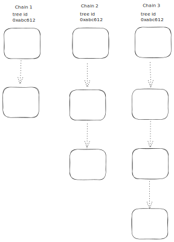

# Voting Ledger Structure

---
Title: Voting Ledger Chain Structure
Status: Proposed
Authors:
    - Alex Pozhylenkov <alex.pozhylenkov@iohk.io>
Created: 2024-08-19
---

## Abstract

This document describes a specification of the voting ledger for the "Catalyst Voices" platform.

## Motivation

A new Catalyst voting platform "Catalyst Voices" requires a solution for storing people votes,
in a transparent, verifiable, scalable and immutable way.

## Specification

### Ledger structure

Voting ledger will be represented as a collection of different, non-connected chains,
processed and run in parallel.
The only common thing for all these chains will be a "tree" identifier,
so these chains will serve and form an overall ledger state.

Obviously, given approach leads to data duplication,
as each chain, will not know anything about others.
And it also requires that the overall ledger state,
could be deterministically defined at any point of time,
considering potential transaction overlapping or duplication.

Hopefully, the "nature" of voting transactions allow us to do that,
which will be discussed in the other section.

Each particular chain, will be as a common sequence of blocks,
which are cryptographically protected by hashing.

The described approach allows to easily scale and increase throughput of the network on demand at any time,
just by starting to process new chains.



### Temporary chains

It is a common thing for blockchains to have a starting block (genesis),
but it's unusual to have a final block for a chain.
After which one no any block could be produced.

And that's a main distinguish for our Voting Ledger structure,
we need to have a final block.
Because, as everyone could know, each voting procedure has a specific time boundaries,
it has a defined start and end time.

By design, time period of the voting procedure (voting start time and ending time),
must be announced publicly for everyone before actual voting starts.
And this data also should be reflected in each chain.

### Block structure

```CDDL
 {{ include_file('src/architecture/08_concepts/voting_ledger/cddl/block.cddl', indent=4) }}
```

### Block validation rules

* `tree_id` **MUST** be the same as for the previous block (except for genesis).
* `chain_id` **MUST** be the same as for the previous block (except for genesis).
* `validator_id` **MUST** be the same as for the previous block (except for genesis).
* `prev_block_id` **MUST** be a hash of the previous block header bytes (except for genesis).
* `timestamp` **MUST** be higher than the `timestamp` of the previous block (except for genesis).

* `type` field for intermidiate block (not a genesis and not a final) **MUST** be absent.
  `type` field for genesis block **MUST** be equals to `0`.
  `type` for final  field **MUST** be equals to `1`.

* `metadata` field allowed **ONLY** for genesis and final block types.

* `validator_signature` **MUST** be a signature of the hashed `block_header` bytes with the `block_data` bytes,
signed by the validator's keys defined in the corresponding certificates referenced by the `validator_id`.
Signature algorithm is defined by the certificate.

* `prev_block_id` and `validator_signature` **MUST** use the same hash function, defined with the `hash_bytes`.

* `prev_block_id` for the genesis block **MUST** be a hash of the defined `chain_id`, `tree_id`, `validator_id` fields and publicly announced voting terms message bytes.

## Rationale
<!-- The rationale fleshes out the specification by describing what motivated the design and what led to particular design decisions. It should describe alternate designs considered and related work. The rationale should provide evidence of consensus within the community and discuss significant objections or concerns raised during the discussion.

It must also explain how the proposal affects the backward compatibility of existing solutions when applicable. If the proposal responds to a CPS, the 'Rationale' section should explain how it addresses the CPS, and answer any questions that the CPS poses for potential solutions.
-->

## Path to Active

### Acceptance Criteria
<!-- Describes what are the acceptance criteria whereby a proposal becomes 'Active' -->

### Implementation Plan
<!-- A plan to meet those criteria or `N/A` if an implementation plan is not applicable. -->

<!-- OPTIONAL SECTIONS: see CIP-0001 > Document > Structure table -->
