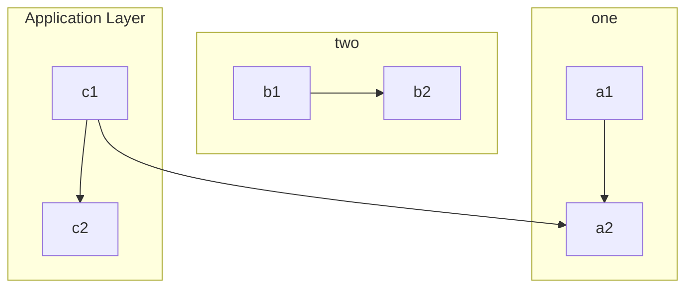

--- *This is a template ADR to be copied and completed when adding new ADR* ---

## Context

What is the issue that we're seeing that is motivating this decision or change?

## Assumptions

Anything that could cause problems if untrue now or later

## Decision

### One

## Risks

Anything that could cause malfunction, delay, or other negative impacts

## Consequences

What becomes easier or more difficult to do because of this change?

## More Information

Provide additional evidence/confidence for the decision outcome
Links to other decisions and resources might here appear as well.
