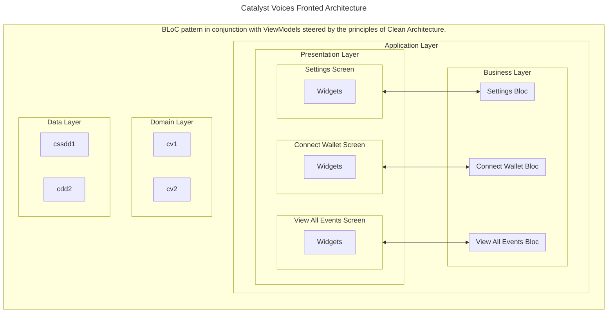

--- *This is a template ADR to be copied and completed when adding new ADR* ---

## Context

Our goal for the Catalyst Voices Frontend App is to establish a structure that ensures scalability,
maintainability, and a clear separation of concerns. With the complexity of voting events,
it’s crucial to have an architecture that supports extensive functionality and easy adaptability to change.

## Assumptions

* Clean Architecture will facilitate a clear separation of concerns across the app.
* The BLoC pattern, combined with ViewModels, will streamline state management across the app.
* Developers are or will become comfortable with reactive programming paradigms and Flutter’s Streams.
* The Flutter community will continue to support and evolve the BLoC pattern.
* The BLoC pattern will be sufficient to handle the app’s state management needs.

## Decision

We have chosen to use BLoC pattern alongside ViewModels, guided by Clean Architecture principles,
for the development of the Catalyst Voices Frontend App.
This approach will segregate the app into distinct layers - presentation, domain, and data,
with BLoC serving as the intermediary for state management and business logic.
The BLoC pattern will manage the app's state reactively,
making it easier to handle complex state dependencies and asynchronous operations.
The ViewModel layer will further aid in abstracting the presentation logic from BLoCs.

### Practical Example

## Risks

* Learning curve associated with Clean Architecture and BLoC pattern for developers not familiar with these concepts.
* Overhead in setting up and managing BLoCs and ViewModels for simpler UI components.
* Potential for boilerplate code, impacting readability and maintainability.

## Consequences

* Enhanced maintainability and testability due to the separation of concerns.
* Greater flexibility in changing or extending the app’s features.
* Improved scalability, as new components can be added with minimal impact on existing code.
* A consistent structure across the app, aiding new developers in understanding the codebase.

## More Information

* [The Clean Architecture](https://blog.cleancoder.com/uncle-bob/2012/08/13/the-clean-architecture.html)
* [BLoC Pattern - DartConf 2018](https://youtu.be/PLHln7wHgPE?si=QJ8hXOCWz2WIYFye)
* [BLoC Pub Documentation](https://bloclibrary.dev/)
* [Flutter BLoC Examples](https://github.com/felangel/bloc/tree/master/examples)
