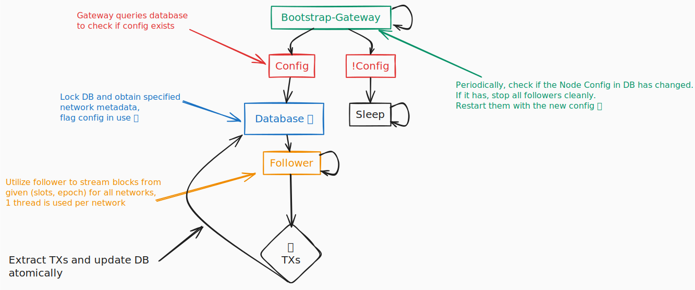
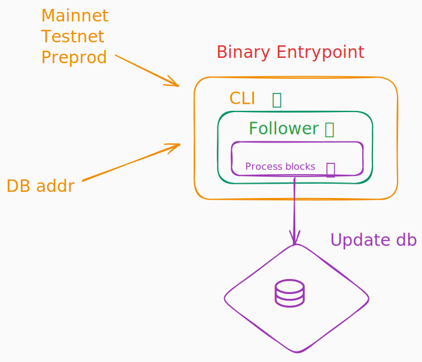
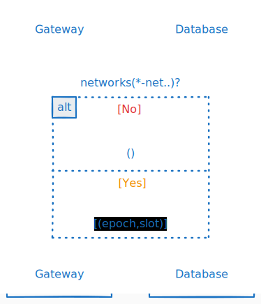

# Gateway Follower

## Mechanics

## Bootstrap

- cli
- specified networks 

## Config 
- check if config exists or in use

## Obtain network metadata

- specified network (slot epoch)

## Follower
- start follower with specified networks
- Stream blocks from given (slot,epoch)

## Process blocks

- As each block is received.
- Parse the block for its era.
- Read UTXO from each transaction.
- Read spent TX from each transaction.
- Check metadata for catalyst registrations.

## Syncing

## Contention

## Multiple nodes

## Roll backs